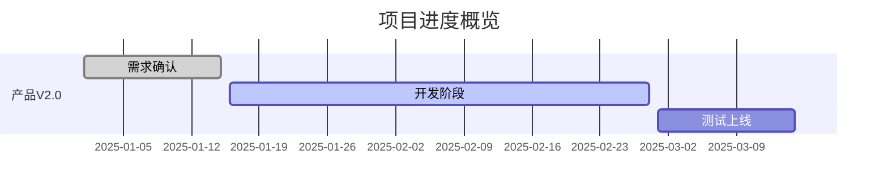
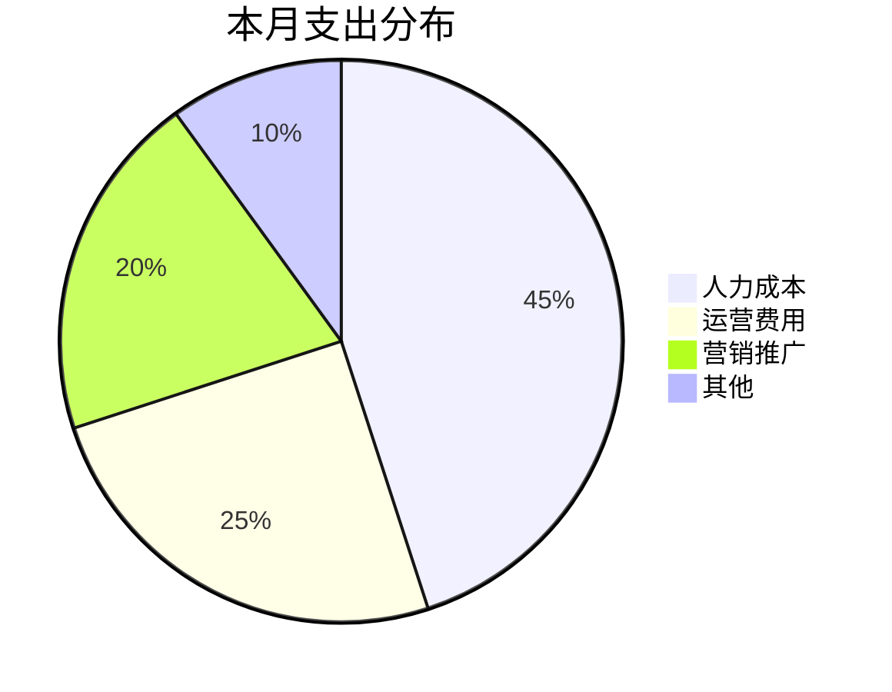

# CEO Dashboard - 管理驾驶舱

整合公司级关键信息，生成管理层报告和决策支持。

## 核心模块

```
┌─────────────────────────────────────────────────────┐
│                   CEO Dashboard                      │
├─────────────┬─────────────┬─────────────┬───────────┤
│   财务模块   │   项目模块   │   OKR模块   │  团队模块  │
│  Cash Flow  │  Projects   │   OKR/KPI   │   Team    │
├─────────────┴─────────────┴─────────────┴───────────┤
│            风险登记 │ 决策记录 │ 周报/月报            │
└─────────────────────────────────────────────────────┘
```

## 数据输入

支持多种输入方式：

| 方式 | 适用场景 | 示例 |
|------|---------|------|
| 口头描述 | 快速更新 | "本周收入50万，支出30万" |
| Excel/CSV | 批量导入 | 上传财务表格、项目清单 |
| Jira API | 项目数据 | 使用 `scripts/jira_sync.py` |
| 手动录入 | 结构化输入 | 按模板填写各模块数据 |

## 模块详情

### 1. 财务模块 (Finance)

**跟踪内容**:
- 现金流：收入、支出、账户余额
- 预算对比：实际 vs 预算、差异分析
- 财务报表：损益表、资产负债表摘要

**数据结构**:
```yaml
finance:
  period: "2025-01-W4"  # 周期
  cash_flow:
    opening_balance: 100000
    income:
      - source: "客户A付款"
        amount: 50000
      - source: "客户B付款"
        amount: 30000
    expenses:
      - category: "人力成本"
        amount: 40000
      - category: "运营费用"
        amount: 15000
    closing_balance: 125000
  budget_vs_actual:
    revenue:
      budget: 100000
      actual: 80000
      variance: -20%
    cost:
      budget: 60000
      actual: 55000
      variance: -8%
```

**输出示例**:
```markdown
## 财务概览 (2025-01-W4)

### 现金流
| 项目 | 金额 |
|------|------|
| 期初余额 | ¥100,000 |
| 本期收入 | ¥80,000 |
| 本期支出 | ¥55,000 |
| 期末余额 | ¥125,000 |

### 预算执行
- 收入完成率: 80% (¥80K/¥100K) ⚠️
- 成本控制: 92% (¥55K/¥60K) ✅
```

### 2. 项目模块 (Projects)

**跟踪内容**:
- 项目状态：进行中、已完成、延期、风险
- 里程碑：关键节点完成情况
- 资源：负责人、参与人员

**数据结构**:
```yaml
projects:
  - name: "产品V2.0开发"
    status: "on_track"  # on_track | at_risk | delayed | completed
    progress: 65%
    owner: "张三"
    milestones:
      - name: "需求确认"
        due: "2025-01-15"
        status: "completed"
      - name: "开发完成"
        due: "2025-02-28"
        status: "in_progress"
    risks:
      - "后端开发资源紧张"
    next_actions:
      - "本周完成API开发"
```

**状态可视化** (Mermaid):


### 3. OKR/KPI 模块

**跟踪内容**:
- Objectives：季度/年度目标
- Key Results：关键结果及完成度
- KPI：关键业绩指标

**数据结构**:
```yaml
okr:
  period: "2025-Q1"
  objectives:
    - objective: "扩大海外市场份额"
      progress: 40%
      key_results:
        - kr: "新增3个海外经销商"
          target: 3
          actual: 1
          progress: 33%
        - kr: "海外收入达到100万"
          target: 1000000
          actual: 350000
          progress: 35%
    - objective: "提升产品质量"
      progress: 70%
      key_results:
        - kr: "客户投诉率降至1%以下"
          target: "1%"
          actual: "0.8%"
          progress: 100%
```

**输出示例**:
```markdown
## OKR 进度 (2025-Q1)

### O1: 扩大海外市场份额 (40%)
█████░░░░░░░░░░░░░░░ 40%

| KR | 目标 | 实际 | 进度 |
|----|------|------|------|
| 新增海外经销商 | 3家 | 1家 | 33% ⚠️ |
| 海外收入 | ¥100万 | ¥35万 | 35% ⚠️ |

### O2: 提升产品质量 (70%)
██████████████░░░░░░ 70%
```

### 4. 团队模块 (Team)

**跟踪内容**:
- 人员概况：总人数、部门分布
- 变动：入职、离职
- 关键岗位状态

**数据结构**:
```yaml
team:
  total_headcount: 25
  departments:
    - name: "研发"
      count: 12
    - name: "销售"
      count: 8
    - name: "运营"
      count: 5
  changes:
    - type: "join"
      name: "李四"
      department: "研发"
      date: "2025-01-20"
  key_positions:
    - role: "技术总监"
      status: "filled"
    - role: "海外销售经理"
      status: "recruiting"
```

### 5. 风险登记 (Risk Register)

**跟踪内容**:
- 风险识别：描述、类别
- 评估：可能性、影响
- 应对：缓解措施、负责人

**数据结构**:
```yaml
risks:
  - id: "R001"
    description: "核心开发人员离职风险"
    category: "人力资源"
    likelihood: "medium"  # low | medium | high
    impact: "high"
    mitigation: "知识文档化、备份人员培养"
    owner: "HR总监"
    status: "monitoring"
```

**风险矩阵输出**:
```
        │ 低影响  │ 中影响  │ 高影响
────────┼─────────┼─────────┼─────────
高可能性│         │         │ ⚠️
中可能性│         │  R002   │  R001
低可能性│  R003   │         │
```

### 6. 决策记录 (Decision Log)

**跟踪内容**:
- 决策事项
- 背景和选项
- 最终决定及理由
- 后续行动

**数据结构**:
```yaml
decisions:
  - id: "D001"
    date: "2025-01-20"
    topic: "是否参加3月份广交会"
    context: "展位费用15万，预期获取50个询盘"
    options:
      - "参展（15万预算）"
      - "不参展，资金用于线上推广"
    decision: "参展"
    rationale: "品牌曝光+直接接触客户的机会难以替代"
    action_items:
      - "本周确认展位"
      - "准备展品和宣传资料"
    decided_by: "CEO"
```

## 报告生成

### 周报模板

使用 `assets/templates/weekly-report.md` 生成：

```markdown
# 管理层周报 (2025-01-W4)

## 本周要点
- ✅ [完成] 产品V2.0需求评审
- ⚠️ [关注] 现金流本月偏紧
- 🚀 [进展] 新签客户2家

## 财务快照
[现金流 + 预算执行摘要]

## 项目状态
[各项目一行摘要]

## OKR 进度
[目标完成度条形图]

## 风险与问题
[Top 3 风险]

## 下周计划
[关键行动项]
```

### 月报模板

使用 `assets/templates/monthly-report.md`，包含更详细的分析。

### Dashboard 视图

生成 Mermaid 图表：



## 工作流程

### 更新数据
```
用户: "更新本周财务：收入50万，支出35万"

Claude:
1. 解析更新内容
2. 更新 data/finance.yaml（或内存状态）
3. 计算变化和趋势
4. 输出确认摘要
```

### 生成报告
```
用户: "生成本周周报"

Claude:
1. 汇总各模块最新数据
2. 计算关键指标和趋势
3. 识别需关注事项
4. 按模板生成 Markdown 报告
5. 保存到 reports/ 目录
```

### 查询状态
```
用户: "OKR进度怎么样？"

Claude:
1. 读取 OKR 数据
2. 计算各目标完成度
3. 识别落后项
4. 输出摘要 + 建议
```

## 输出目录结构

```
ceo_dashboard/
├── data/
│   ├── finance.yaml
│   ├── projects.yaml
│   ├── okr.yaml
│   ├── team.yaml
│   ├── risks.yaml
│   └── decisions.yaml
├── reports/
│   ├── weekly/
│   │   └── 2025-W04.md
│   └── monthly/
│       └── 2025-01.md
└── dashboard.md  # 实时概览
```

## 与其他 Skills 配合

| 场景 | 配合 Skill | 用法 |
|------|-----------|------|
| 从 Jira 同步项目 | jira-planner | 拉取项目状态到 Dashboard |
| 分析市场机会 | market-research | 机会发现 → 决策记录 |
| 海外拓展计划 | go-to-market | GTM 进度纳入项目跟踪 |

## 使用示例

**快速状态查询**:
```
用户: 公司现在状态怎么样？
→ 输出：财务、项目、OKR 的一页摘要
```

**数据更新**:
```
用户: 记录一下，今天决定参加广交会，预算15万
→ 更新决策记录，关联财务支出计划
```

**生成报告**:
```
用户: 生成给投资人看的月报
→ 生成正式月报，强调财务和里程碑
```

## 注意事项

1. **数据保密**: Dashboard 数据可能包含敏感信息，注意存储安全
2. **数据一致性**: 定期核对实际数据，避免偏差积累
3. **简洁优先**: CEO 视角关注关键指标，避免信息过载
4. **趋势比数字重要**: 突出变化趋势而非静态数字
5. **行动导向**: 每个问题都应有建议的下一步行动
