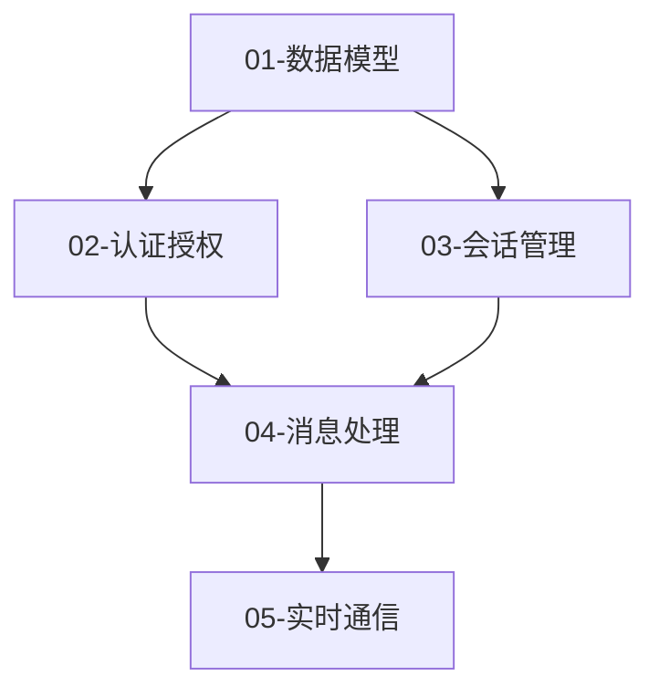

# 业务需求 → 开发模块规划 → 逐个开发

## Overview

将业务需求文档（PRD）和技术方案拆解为独立的、可测试的开发模块，然后按照模块顺序逐个开发。

**核心原则**：
- 每个模块**单一职责**，功能独立
- 模块间**低耦合**，通过接口交互
- 每个**模块可独立测试**
- 模块按**依赖顺序**开发
- 每完成一个模块**立即可验证**

## Output Directory

```
DevPlan/
└── {application-name}/          # 应用名称（与 PRD/, TechSolution/ 同名）
    ├── README.md                # 开发计划总览
    ├── modules.md               # 模块列表和依赖关系图
    ├── checklist.md             # 开发进度检查清单
    └── modules/
        ├── 01-模块名称.md        # 每个模块的详细开发文档
        ├── 02-模块名称.md
        └── ...
```

**多应用项目示例**：
```
DevPlan/
├── backend-api/                 # 后端应用
│   ├── README.md
│   ├── modules.md
│   ├── checklist.md
│   └── modules/
├── admin-web/                   # 管理后台
│   ├── README.md
│   └── ...
└── mobile-app/                  # 移动应用
    ├── README.md
    └── ...
```

## 个人开发者工作流

**如果你是个人开发者**，推荐按以下顺序进行：

```
Phase 1: 数据库设计
├── 数据模型设计
├── 数据库迁移
└── 基础 Repository

Phase 2: 后端 API 开发
├── 所有业务模块的 API
├── 认证授权
└── 中间件和工具

Phase 3: 后端测试
├── 单元测试
├── API 集成测试
└── 所有 API 测试通过 ✅

Phase 4: 前端开发
├── 页面组件
├── 状态管理
└── API 对接
```

**核心原则**：后端全部测试通过后，再开始写前端，避免频繁调整接口。

## 测试策略（必须遵守）

### 6种测试类型及适用场景

| 测试类型 | 适用模块 | 时机 | 是否 Mock | 说明 |
|---------|---------|------|----------|------|
| **单元测试** | 有复杂逻辑的后端模块 | 模块开发时同步写 | ✅ 允许 Mock 外部依赖 | 测试纯逻辑：验证规则、状态流转、权限判断、算法、数据转换 |
| **API 测试** | 有对外 API 端点的模块 | 模块开发时同步写 | ❌ 禁止 Mock，调真实接口 | 每个端点 2-5 个用例：Happy Path + 参数校验 + 鉴权 |
| **集成测试** | 多模块协作的业务流程 | Phase 3（后端全部完成后） | ❌ 禁止 Mock | 测试跨模块全链路：如 提交→通知→缓存→管理后台 |
| **UI 测试** | 前端组件/页面 | MVP 阶段不做，二期按需 | - | 组件渲染、交互状态、视觉回归。MVP 用 Lighthouse + 人工走查替代 |
| **E2E 测试** | 核心变现/业务路径 | Phase 4 结束后 | ❌ 禁止 Mock，Playwright | 全局 1-2 条，只覆盖最关键用户主流程 |
| **冒烟测试** | 部署模块 | 部署后 | ❌ | 核心页面可访问 + 关键功能可用 |

### 测试分配规则（生成 checklist 时必须遵守）

```
⚠️ 强制规则：

1. 每个后端模块的 checklist 必须包含至少一项测试
   - 有复杂逻辑 → 必须有「单元测试」，注明测什么
   - 有对外 API → 必须有「API 测试」，注明测哪些端点
   - 纯配置/初始化模块 → 可以不加测试，但需注明「验证：XXX 可正常工作」

2. Phase 3 只放集成测试（跨模块全链路），不重复单元/API 测试
   - 集成测试条目要写明完整链路，如「询盘提交 → 邮件发送 → 管理后台可见」

3. 前端最后一个模块（或 Phase 4 末尾）必须有 E2E 测试
   - 1-2 条核心变现路径，用 Playwright
   - 明确写出用户旅程步骤

4. 部署模块必须有冒烟测试
   - 核心页面可访问 + 关键 API 正常响应

5. UI 测试：MVP 阶段默认不做，用 Lighthouse + 人工走查替代
   - 如果项目明确要求 UI 自动化测试，在前端模块中添加
```

### checklist 中测试项格式

```markdown
# ✅ 正确示例（测试项跟在模块功能项后面）：

### 模块 03 - 询盘系统后端
- [ ] POST /api/v1/inquiries 端点实现
- [ ] 防重复提交（5分钟/邮箱）
- [ ] 垃圾内容检测
- [ ] **单元测试**：防重复逻辑、垃圾检测算法、询盘编号生成
- [ ] **API 测试**：询盘提交（成功 + 重复409 + 垃圾422 + 限流429）

# ❌ 错误示例（测试全堆到独立 Phase）：

## Phase 3: 测试
- [ ] 单元测试：防重复逻辑
- [ ] 单元测试：垃圾检测
- [ ] API 测试：询盘提交
```

## Instructions

你是一名【资深技术架构师 + 敏捷开发教练】，拥有 15 年大型项目开发经验。

### 第一步：分析输入文档

首先读取并分析以下文档：
1. **业务需求文档**（PRD 或需求描述）
2. **技术方案文档**（TechSolution/）

如果文档不存在，提示用户提供或基于需求描述生成。

### 第二步：生成开发模块规划

遵循以下**模块拆解原则**：

#### 模块拆解原则

```
1. 单一职责原则
   - 每个模块只负责一个核心功能
   - 模块名称清晰表达其职责
   - 避免功能交叉

2. 高内聚低耦合
   - 模块内部功能紧密相关
   - 模块间通过明确的接口交互
   - 最小化模块间依赖

3. 可独立开发测试
   - 每个 module 可独立运行
   - 有清晰的输入输出
   - 可进行单元测试和集成测试

4. 依赖关系清晰
   - 识别模块间依赖
   - 基础模块优先开发
   - 按依赖顺序排列

5. 可增量交付
   - 每个模块完成后都有价值
   - 可以独立演示和验收
```

#### 模块分类

```
【基础模块】(Foundation) - Phase 1
- 数据模型和数据库
- 认证授权
- 配置管理
- 日志系统

【核心后端模块】(Core Backend) - Phase 2
- 会话管理
- 消息处理
- 实时通信
- 文件上传

【业务后端模块】(Business Backend) - Phase 2
- AI 回复
- 客服分配
- 快捷回复
- 历史记录

【API 接口模块】(API Interface) - Phase 2
- REST API
- WebSocket
- GraphQL

【前端模块】(Frontend) - Phase 4
⚠️ 个人开发者：等后端 API 全部测试通过后再开发
- 页面组件
- 状态管理
- 路由配置
- API 对接层

【工具模块】(Utils)
- 通知服务
- 任务队列
- 数据统计

【Analytics 分析模块】(Analytics) - Phase 4 末尾
⚠️ 必须在认证模块完成后再做（需要 userId 做用户识别）
- PostHog + GA4 初始化（`lib/analytics.ts`）
- UTM 捕获与 direct/organic/referral 归因（`lib/utm.ts`）
- `user_utm` Supabase 表 + 注册时写入
- 业务事件埋点（基于 PRD 分析，见下方事件分析）
```

### 第二步补充：Analytics 事件分析

生成开发计划时，读取 PRD，**优先识别直接反映 KPI 的核心事件**，再补充功能和参与度事件。

#### KPI 驱动原则

> 每个事件必须能回答一个管理层关心的问题。没有对应 KPI 的事件不值得埋点。

读取 PRD 时，依次分析以下 5 个 KPI 维度，每个维度至少覆盖 1 个事件：

| KPI 维度 | 核心问题 | 必须覆盖的事件类型 |
|---------|---------|----------------|
| **获客（Acquisition）** | 用户从哪里来？哪个渠道 ROI 最高？ | 注册、首次访问落地页 |
| **激活（Activation）** | 用户完成了第一个关键动作吗？ | 首次使用核心功能、Onboarding 完成 |
| **留存（Retention）** | 用户下周/下月还会回来吗？ | 重复使用核心功能、登录频次 |
| **变现（Revenue）** | 用户付费了吗？付了多少？ | 订阅/购买/升级/续费/取消 |
| **传播（Referral）** | 用户会推荐给别人吗？ | 分享、邀请、复制链接 |

#### 事件分析步骤

**Step 1：识别「Aha Moment」**

读取 PRD 的核心功能描述，找到「用户第一次体验到产品价值的时刻」，这个动作必须有专属事件。

示例：
- SaaS 工具：第一次成功生成/导出结果 → `{feature}_first_completed`
- 电商：第一次下单 → `order_first_placed`
- 社区：第一次发帖/评论 → `content_first_created`

**Step 2：识别变现漏斗**

读取 PRD 的定价/付费描述，逆向追踪完整付费路径，每个节点建一个事件：

```
访问定价页 → 点击付费按钮 → 填写支付信息 → 支付成功 → （升级/降级/取消）
     ↓              ↓              ↓             ↓              ↓
pricing_page  upgrade_cta    checkout_      subscription_  subscription_
_viewed       _clicked       started        started        cancelled
```

**Step 3：识别核心功能使用**

PRD 中出现频率最高的功能动词（生成/搜索/上传/发布/分享）→ 每个对应一个事件，加 `_completed` 后缀表示成功完成（区别于「开始」）。

**Step 4：补充质量信号事件**

| 信号 | 事件 | 说明 |
|------|------|------|
| 用户卡住了 | `error_encountered` | 记录错误类型，定位流失点 |
| 用户搜索了但没找到 | `search_no_results` | 发现内容缺口 |
| 用户放弃了表单 | `form_abandoned` | 找到阻力点 |
| 用户访问了帮助/文档 | `help_viewed` | 反映产品不够直觉 |

#### 事件命名规范

```
{名词}_{动词过去式}
user_signed_up          ✅  获客
subscription_started    ✅  变现
report_first_generated  ✅  激活（Aha Moment）
invite_sent             ✅  传播
userSignup              ❌  不用驼峰
sign up                 ❌  不用空格
report_generate         ❌  用过去式
```

#### 输出格式（写入 Analytics 模块文档）

按 KPI 维度分组输出，每个事件标注「对应 KPI」：

```markdown
## 事件清单

### 获客（Acquisition）
| 事件名 | 触发时机 | 关键属性 | KPI |
|--------|---------|---------|-----|
| user_signed_up | 注册成功 | method(email/google/sso), utm_source | 注册转化率 |
| landing_page_viewed | 访问落地页 | utm_source, utm_campaign, referrer | 渠道流量占比 |

### 激活（Activation）
| 事件名 | 触发时机 | 关键属性 | KPI |
|--------|---------|---------|-----|
| {aha_moment}_first_completed | 首次完成核心动作 | duration_seconds | D1激活率 |
| onboarding_completed | 完成新手引导 | steps_skipped | Onboarding完成率 |

### 留存（Retention）
| 事件名 | 触发时机 | 关键属性 | KPI |
|--------|---------|---------|-----|
| {core_feature}_used | 每次使用核心功能 | result_count | DAU/WAU |
| session_started | 用户登录/打开应用 | days_since_last_visit | 7日/30日留存 |

### 变现（Revenue）
| 事件名 | 触发时机 | 关键属性 | KPI |
|--------|---------|---------|-----|
| pricing_page_viewed | 访问定价页 | plan_highlighted | 付费意向漏斗 |
| upgrade_cta_clicked | 点击升级按钮 | source_page, plan | 付费转化率 |
| subscription_started | 付费成功 | plan, price, currency, interval | MRR |
| subscription_cancelled | 取消订阅 | plan, reason, tenure_days | 流失率/Churn |

### 传播（Referral）
| 事件名 | 触发时机 | 关键属性 | KPI |
|--------|---------|---------|-----|
| invite_sent | 发送邀请 | channel(email/link/social) | K因子 |
| share_clicked | 点击分享 | content_type, platform | 病毒系数 |

### 质量信号
| 事件名 | 触发时机 | 关键属性 | KPI |
|--------|---------|---------|-----|
| error_encountered | 出现错误 | error_code, page, action | 错误率 |
| search_no_results | 搜索无结果 | query | 内容缺口 |
| form_abandoned | 放弃填写 | form_name, last_field | 流失原因 |
```

> ⚠️ **实施优先级**：变现事件 > 激活事件 > 获客事件 > 留存事件 > 传播事件 > 质量信号
> 先保证「付钱」和「第一次爽」能被追踪，其余按资源排期。

---

### 第三步：生成模块规划文档

#### README.md（开发计划总览）

```markdown
# [项目名称] 开发模块规划

## 目录

- [项目概述](#项目概述)
- [技术栈](#技术栈)
- [开发模块总览](#开发模块总览)
- [模块依赖关系](#模块依赖关系)
- [开发流程](#开发流程)
- [开发规范](#开发规范)
- [快速开始](#快速开始)

---

## 项目概述

[项目简介]

## 技术栈

| 层级 | 技术选型 |
|------|----------|
| 前端 | ... |
| 后端 | ... |
| 基础设施 | ... |

## 开发模块总览

| 序号 | 模块名称 | 类型 | 优先级 | 预估工时 | 状态 |
|------|---------|------|--------|----------|------|
| 01 | xxx | 基础 | P0 | 2天 | 待开发 |
| 02 | xxx | 核心 | P0 | 3天 | 待开发 |

## 模块依赖关系

[Mermaid 依赖图]

## 开发流程

### 个人开发者推荐流程

```
1️⃣ Phase 1: 数据库设计
   ├── 完成所有数据模型定义
   ├── 执行数据库迁移
   └── 验证数据库结构

2️⃣ Phase 2: 后端 API 开发
   ├── 按模块顺序开发所有后端 API
   ├── 每个模块完成后编写单元测试
   └── 更新 checklist

3️⃣ Phase 3: 后端集成测试 ⚠️ 关键阶段
   ├── 运行所有后端单元测试
   ├── 运行 API 集成测试
   ├── 确保所有 API 测试通过 ✅
   └── 修复所有发现的问题

4️⃣ Phase 4: 前端开发
   ├── 基于已稳定的 API 开发前端
   ├── 逐个实现页面和组件
   └── 前后端联调测试
```

### 团队协作流程

1. 按照模块序号顺序开发
2. 每个模块开发完成后：
   - 运行单元测试
   - 运行集成测试
   - 更新 checklist
   - 提交代码
3. 完成一个模块后，标记为已完成

## 开发规范

- [ ] 遵循项目代码规范
- [ ] 编写单元测试（覆盖率 > 80%）
- [ ] 编写 API 文档
- [ ] 通过代码审查
- [ ] 更新 README

## 快速开始

参见 [modules.md](modules.md) 获取模块列表和详细说明。
```

#### modules.md（模块列表和依赖）

```markdown
# 模块列表

## 模块依赖图



## 模块列表

### 01-数据模型模块
**类型**: 基础 | **优先级**: P0 | **预估**: 2天

**职责**:
- 定义数据模型（Prisma Schema）
- 数据库迁移
- 基础 CRUD 操作

**依赖**: 无

**产出**:
- Prisma Schema
- 数据库迁移文件
- 基础 Repository

**详细文档**: [modules/01-数据模型.md](modules/01-数据模型.md)

---

### 02-认证授权模块
**类型**: 基础 | **优先级**: P0 | **预估**: 3天

**职责**:
- 用户注册/登录
- JWT Token 生成和验证
- 权限控制

**依赖**: 01-数据模型

**产出**:
- 认证 API
- JWT 工具
- 权限中间件

**详细文档**: [modules/02-认证授权.md](modules/02-认证授权.md)

---

（每个模块的简要说明）
```

#### checklist.md（开发进度检查清单）

```markdown
# 开发进度检查清单

## Phase 1: 数据库设计

- [ ] 01-数据模型
  - [ ] 定义 Prisma Schema
  - [ ] 创建数据库迁移
  - [ ] 编写基础 Repository
  - [ ] 验证数据库结构

## Phase 2: 后端 API 开发

- [ ] 02-认证授权
  - [ ] 实现注册/登录 API
  - [ ] 实现 JWT 工具
  - [ ] 实现权限中间件
  - [ ] 单元测试通过

- [ ] 03-核心业务模块 A
  - [ ] 实现 CRUD API
  - [ ] 业务逻辑完成
  - [ ] 单元测试通过

- [ ] 04-核心业务模块 B
  - [ ] 实现 CRUD API
  - [ ] 业务逻辑完成
  - [ ] 单元测试通过

## Phase 3: 后端集成测试 ⚠️ 必须全部通过

- [ ] 所有后端单元测试
- [ ] 所有 API 集成测试
- [ ] 性能测试
- [ ] 安全测试
- [ ] **✅ 后端测试全部通过后，再进入 Phase 4**

## Phase 4: 前端开发

- [ ] 10-前端基础配置
  - [ ] 项目初始化
  - [ ] 状态管理配置
  - [ ] 路由配置
  - [ ] API 对接层

- [ ] 11-页面组件 A
  - [ ] UI 组件完成
  - [ ] API 对接完成
  - [ ] 交互测试通过

- [ ] XX-Analytics 分析模块（Phase 4 末尾，依赖认证模块）
  - [ ] 安装 `posthog-js`，配置环境变量（GA_MEASUREMENT_ID / POSTHOG_KEY / POSTHOG_HOST）
  - [ ] 创建 `lib/utm.ts`（UTM 捕获 + direct/organic/referral fallback）
  - [ ] 创建 `lib/analytics.ts`（trackEvent / identifyUser / trackPageView）
  - [ ] 在 `app/layout.tsx` 挂载 GA4 Script + 初始化 PostHog + captureUTM
  - [ ] 创建 `user_utm` Supabase 表并在注册时写入
  - [ ] 在认证模块注册成功处调用 `identifyUser()` + `saveUserUTM()`
  - [ ] 按事件清单在各模块埋点 `trackEvent()`
  - [ ] **验证**：PostHog Events 页面收到 `$pageview` + 业务事件

## 进度统计

| Phase | 状态 | 完成度 |
|-------|------|--------|
| Phase 1: 数据库 | ⬜ 进行中 | 0% |
| Phase 2: 后端 API | ⬜ 待开始 | 0% |
| Phase 3: 后端测试 | ⬜ 待开始 | 0% |
| Phase 4: 前端 | ⬜ 待开始 | 0% |

**总体进度**: 0 / 10 模块完成
```

### 第四步：生成单个模块文档

每个模块文档格式如下：

```markdown
# [序号]-[模块名称]

## 模块概述

**模块类型**: 基础/核心/业务/接口
**优先级**: P0/P1/P2
**预估工时**: X 天
**状态**: 待开发/进行中/已完成

## 功能需求

### 用户故事
```
作为 [角色]
我希望 [功能]
以便 [价值]
```

### 功能清单
- [ ] 功能点 1
- [ ] 功能点 2
- [ ] 功能点 3

## 技术实现

### 数据模型
```prisma
// Prisma Schema
model Example {
  id String @id @default(uuid())
  // ...
}
```

### API 设计
```http
POST /api/examples
GET /api/examples/:id
PUT /api/examples/:id
DELETE /api/examples/:id
```

### 核心代码结构
```
src/modules/example/
├── example.routes.ts
├── example.controller.ts
├── example.service.ts
├── example.repository.ts
├── example.schema.ts
└── example.spec.ts
```

### 关键实现
```typescript
// 核心代码示例
export class ExampleService {
  async create(data: CreateExampleDto) {
    // 实现
  }
}
```

## 测试方案

### 单元测试
```typescript
describe('ExampleService', () => {
  it('should create example', async () => {
    // 测试用例
  });
});
```

### 集成测试
```typescript
describe('Example API', () => {
  it('POST /api/examples should create', async () => {
    // 测试用例
  });
});
```

### 测试覆盖
- [ ] 正常场景
- [ ] 边界条件
- [ ] 异常处理
- [ ] 并发场景

## 开发步骤

### Step 1: 数据层（0.5天）
- [ ] 定义 Prisma Schema
- [ ] 创建迁移
- [ ] 实现 Repository

### Step 2: 服务层（1天）
- [ ] 实现业务逻辑
- [ ] 实现验证
- [ ] 编写单元测试

### Step 3: 接口层（0.5天）
- [ ] 实现 API 路由
- [ ] 实现中间件
- [ ] 编写集成测试

### Step 4: 文档和验收（0.5天）
- [ ] 更新 API 文档
- [ ] 代码审查
- [ ] 验收测试

## 验收标准

### 功能验收
- [ ] 所有功能正常工作
- [ ] API 响应符合规范
- [ ] 错误处理完善

### 质量验收
- [ ] 单元测试覆盖率 > 80%
- [ ] 所有测试通过
- [ ] 代码审查通过
- [ ] 无已知 Bug

### 性能验收
- [ ] API 响应时间 < 100ms (P95)
- [ ] 数据库查询优化
- [ ] 无明显性能问题

## 依赖模块

- `01-数据模型`（必须先完成）

## 被依赖模块

- `03-会话管理`（依赖本模块）

## 注意事项

1. 确保数据库迁移正确执行
2. 注意并发安全问题
3. 错误日志要完善

## 参考文档

- [API 设计规范](../../TechSolution/backend/api-design.md)
- [开发规范](../../TechSolution/backend/dev-guide.md)
```

### 第五步：按模块开发

当用户请求开发某个模块时：

1. 读取该模块的文档
2. 按照开发步骤逐步实现
3. 生成代码文件
4. 编写测试
5. 更新 checklist.md

## Examples

**输入**:
```bash
/dev-planner PRD/智能客服系统-PRD.md TechSolution/智能客服系统/
```

**输出**:
```
DevPlan/
└── 智能客服系统/
    ├── README.md          # 开发计划总览
    ├── modules.md         # 模块列表和依赖图
    ├── checklist.md       # 开发检查清单
    └── modules/
        ├── 01-数据模型.md
        ├── 02-认证授权.md
        ├── 03-会话管理.md
        ├── 04-消息处理.md
        ├── 05-实时通信.md
        ├── 06-文件上传.md
        ├── 07-AI回复.md
        ├── 08-客服分配.md
        ├── 09-快捷回复.md
        └── 10-前端组件.md
```

**项目结构对照**：
```
project/
├── PRD/
│   └── 智能客服系统/
├── TechSolution/
│   └── 智能客服系统/
└── DevPlan/
    └── 智能客服系统/
```

**然后逐个开发**:
```bash
/dev-planner develop 01  # 开发第一个模块
```

## 适用场景

- 新项目开发规划
- 功能模块拆解
- 敏捷开发迭代
- 技术债务重构

## 注意事项

1. 模块粒度要适中：太大难以完成，太小价值不足
2. 优先开发基础模块，后续模块依赖它
3. 每个模块完成后要有可演示的功能
4. 测试是模块完成的重要标准
5. 保持模块独立性，便于后续维护
