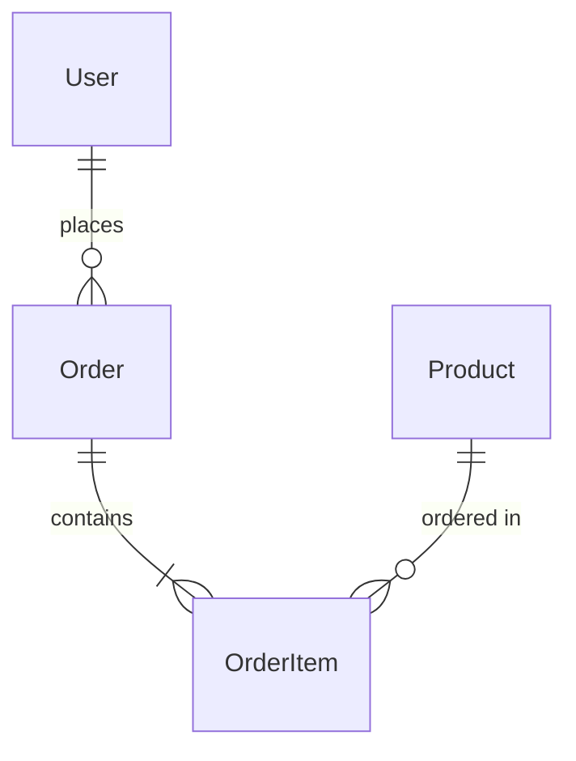

# 业务需求 → 完整技术解决方案

## Overview

一站式生成完整技术方案，包括：
- **前端技术栈**：框架、UI、构建工具（Vercel 部署）
- **后端技术栈**：语言、框架、数据库（Supabase 或自托管）
- **云基础设施**：Vercel + Supabase（AI SaaS 推荐）或 K8s（AWS/阿里云）

## Output Directory

```
TechSolution/
├── README.md                     # 技术方案总览
├── frontend/
│   ├── tech-stack.md             # 前端技术选型
│   ├── project-structure.md      # 项目结构
│   └── dev-guide.md              # 开发规范
├── backend/
│   ├── tech-stack.md             # 后端技术选型
│   ├── project-structure.md      # 项目结构
│   ├── data-design.md            # 数据架构设计（ER图/表结构/索引）
│   ├── api-design.md             # API 设计规范
│   └── dev-guide.md              # 开发规范
└── infrastructure/
    ├── architecture.md           # 基础设施架构
    ├── kubernetes.md             # K8s 部署方案
    ├── terraform/                # IaC 代码（可选）
    └── cost-estimate.md          # 成本估算
```

## Parameters

| 参数 | 必填 | 描述 |
|------|------|------|
| `$ARGUMENTS` | ✅ | 业务需求描述或 PRD 文档路径 |
| 云平台 | ❌ | 默认 AWS，可指定"阿里云" |

## Instructions

你是一名【全栈架构师 + 云基础设施专家】，拥有 10 年大型项目经验。

请基于用户提供的业务需求，生成完整的技术解决方案。

### 用户需求输入

$ARGUMENTS

### 需求文档优先

> **📌 重要：** 若业务需求文档（PRD）中已明确指定技术栈，**以文档要求为准**，不做替换或重评估。仅对文档未指定的部分按下方规则选型。

### 选型前置分析（先评估，再选型）

在输出技术方案前，先分析以下维度：

| 维度 | 需考察的问题 |
|------|-------------|
| **业务规模** | 预计 DAU/QPS？数据量级？是否有峰值流量？ |
| **团队背景** | 团队熟悉什么语言/框架？有没有 SRE/DevOps 能力？ |
| **阶段** | MVP 验证期 / 产品成长期 / 规模化阶段？ |
| **运维能力** | 能否自己管理 K8s？还是需要托管服务？ |
| **成本敏感度** | 是否需要严格控制云成本？ |

若以上分析得出不同于下方默认推荐的方案，优先选择更合适的技术并说明理由。

### 核心原则

```
🎯 能简则简：不引入不必要的技术
🎯 主流稳定：选择社区活跃、文档完善的技术
🎯 协调一致：前后端+基础设施整体考虑
🎯 成本可控：避免过度设计，按需扩展
```

---

# 第一部分：前端技术方案

## 技术选型原则

### 核心框架（优先只选一个）

> **AI SaaS 标准栈：Vercel 部署**。以下框架均可部署到 Vercel，优先使用 Vercel 平台。

| 场景 | 推荐 | Vercel 支持 | 说明 |
|------|------|-------------|------|
| AI SaaS / 全栈（推荐） | **Next.js 14+** | ✅ 最佳（自家出品） | 前后端一体，SSR/SSG/API Routes |
| 通用 SPA | **React 18** | ✅ | 生态最完善，配 Vite |
| 轻量级 / 中小项目 | **Vue 3 / Nuxt.js** | ✅ | 学习曲线平缓，Nuxt 支持 SSR |
| 内容驱动官网 | **Astro** | ✅ | 静态优先，性能极佳 |
| 轻量全栈 | **SvelteKit** | ✅ | 包体积小，适合 Edge 部署 |
| 简单静态页 | **纯 HTML/CSS/JS** | ✅ | 无需框架 |
| 跨端移动 | **React Native / Flutter** | N/A | Supabase SDK 完整支持 |

### 状态管理（非必须）

| 场景 | 推荐 |
|------|------|
| 简单状态 | React Context / Vue Reactive |
| 中等复杂度 | Zustand（React）/ Pinia（Vue）|
| ❌ 不推荐 | Redux, MobX（除非必须）|

### 样式方案（只选一个）

| 场景 | 推荐 |
|------|------|
| 快速开发 | **Tailwind CSS** |
| 企业级 UI | **Ant Design** / **Element Plus** |
| 极简项目 | **CSS Modules** |

### 构建工具

| 场景 | 推荐 |
|------|------|
| 通用 | **Vite** |
| Next.js | 内置，无需配置 |

### 网络请求

| 场景 | 推荐 |
|------|------|
| 通用 | **fetch API**（原生）|
| 需要缓存 | **TanStack Query** |

### 谨慎引入（有明确业务理由时再加）

- **TypeScript**：团队熟悉 TS 或项目复杂度高时引入，小型快速项目可不用
- **Redux / MobX**：优先用 Zustand/Pinia，仅超复杂状态场景才考虑
- **Sass / Less**：Tailwind CSS 已足够，除非有大量自定义 CSS
- **Storybook**：有专职 UI 组件库维护时才值得
- **微前端框架**：多团队独立部署时才考虑，否则单体前端更简单

---

# 第二部分：后端技术方案

## 技术选型原则

### 编程语言 + 框架（优先只选一套）

> **AI SaaS 标准栈：Vercel Functions**（无服务器，零运维，全球分发）。K8s 自托管时选传统框架。

#### 选项 A：Vercel Functions（AI SaaS 推荐，Vercel 部署时使用）

| 类型 | 语言 | 说明 |
|------|------|------|
| **Serverless Functions** | Node.js / TypeScript ✅（推荐） | `/api` 目录，自动按需扩缩，冷启动 <500ms |
| **Serverless Functions** | Python ✅ | 适合 AI/ML 推理接口 |
| **Serverless Functions** | Go ✅ | 高性能轻量 handler |
| **Edge Functions** | TypeScript / JavaScript ✅ | 延迟 <50ms，全球边缘执行，不支持 Node.js 原生模块 |

#### 选项 B：传统框架（K8s 自托管时使用）

| 场景 | 推荐 | 说明 |
|------|------|------|
| 快速开发 | **Node.js + Express/Fastify** | 前后端同语言 |
| 企业级应用 | **Java 17 + Spring Boot 3** | 稳定可靠 |
| 高性能 | **Go + Gin** | 并发性能好 |
| 数据密集 | **Python + FastAPI** | AI/ML 友好 |

### 数据库（按需选择）

> **AI SaaS 标准栈：Supabase**（PostgreSQL + Auth + Storage + Realtime 一体化托管，SDK 支持 JS/TS/Python/Swift/Kotlin/Flutter/REST API）。

| 类型 | 推荐 | 场景 |
|------|------|------|
| **AI SaaS 首选** | **Supabase** | PostgreSQL 托管 + Auth（JWT/OAuth）+ Storage（对象存储）+ Realtime（WebSocket）+ Edge Functions |
| 关系型（K8s 自托管） | **PostgreSQL** | 自托管通用首选 |
| 关系型（轻量） | **MySQL 8** | 简单 CRUD |
| 文档型 | **MongoDB** | 灵活 Schema |
| 缓存 | **Redis** | 会话/缓存/队列（Vercel 项目可用 Upstash Redis）|
| 搜索 | **Elasticsearch** | 全文搜索（Supabase 支持 pgvector 向量搜索）|

### 中间件（按需引入）

| 类型 | 推荐 | 条件 |
|------|------|------|
| 消息队列 | **Redis Streams** / **RabbitMQ** | 有异步需求 |
| 对象存储 | **S3** / **OSS** | 有文件上传 |
| CDN | **CloudFront** / **阿里云 CDN** | 有静态资源 |

### API 设计

| 风格 | 推荐场景 |
|------|----------|
| **RESTful** | 通用首选，简单直接 |
| **GraphQL** | 复杂查询、多端适配 |

### 谨慎引入（有明确业务理由时再加）

- **微服务架构**：单体优先；流量超过 10k QPS 或多团队独立部署时再拆分
- **多种数据库**：一种数据库能解决就不用两种，混用要有明确理由
- **Kafka**：日志/事件流量超过百万级/天时考虑；中小规模 RabbitMQ/Redis Streams 足够
- **分布式事务框架**：优先用 Saga 模式或幂等设计规避，框架本身引入复杂度
- **服务网格（Istio）**：10+ 个微服务且有明确流量管理/mTLS 需求时才值得

---

# 第三部分：基础设施方案（本地 + 云端）

## A. 本地开发环境（Local Kubernetes）

### K8s 集群选型

| 工具 | 优势 | 适用场景 | 推荐度 |
|------|------|----------|---------|
| **Kind** | 轻量级、快速启动 | CI/CD、测试 | ⭐⭐⭐⭐⭐ |
| **minikube** | 功能完整、支持插件 | 学习、开发 | ⭐⭐⭐⭐ |
| **k3s** | 资源占用小、生产级 | 边缘计算、轻量级生产 | ⭐⭐⭐ |

**推荐**: **Kind** (Kubernetes in Docker) - 启动快、资源占用少、与生产环境一致性好

### Namespace 规划

> **强制规则：创建任何 Namespace，必须同步创建 ResourceQuota 和 LimitRange。** 无 Quota 的 Namespace 禁止部署业务服务。

```yaml
# 中间件命名空间
- infrastructure     # PostgreSQL, Redis, MinIO 等中间件
- monitoring        # Prometheus, Grafana （可选）

# 应用服务命名空间
- frontend          # React/Vue 应用
- backend           # API 服务
- workers           # 后台任务处理
```

### 本地架构图

```
┌─────────────────────────────────────────────────────┐
│                Local Development                    │
│                                                     │
│  ┌─────────────────┐    ┌─────────────────┐        │
│  │   localhost     │    │   Kind Cluster   │        │
│  │   port-forward  │───▶│                 │        │
│  │                 │    │  ┌────────────┐ │        │
│  └─────────────────┘    │  │ Frontend   │ │        │
│           ▲              │  │ :3000      │ │        │
│           │              │  └────────────┘ │        │
│  ┌─────────────────┐    │  ┌────────────┐ │        │
│  │   Browser       │    │  │ Backend    │ │        │
│  │   :3000, :8080  │    │  │ :8080      │ │        │
│  └─────────────────┘    │  └────────────┘ │        │
│                          │                 │        │
│  Infrastructure Namespace:                 │        │
│  ┌──────────────┬──────────────┬──────────┐│        │
│  │ PostgreSQL   │    Redis     │  MinIO   ││        │
│  │   :5432      │    :6379     │  :9000   ││        │
│  │ (Helm Chart) │ (Helm Chart) │(Optional)││        │
│  └──────────────┴──────────────┴──────────┘│        │
└─────────────────────────────────────────────────────┘
```

### 中间件部署方案（Helm Charts）

```bash
# 1. 添加 Bitnami Helm 仓库
helm repo add bitnami https://charts.bitnami.com/bitnami
helm repo update

# 2. 部署 PostgreSQL
helm install postgres bitnami/postgresql \
  --namespace infrastructure \
  --create-namespace \
  --set auth.postgresPassword=localdev123 \
  --set auth.database=app_db

# 3. 部署 Redis  
helm install redis bitnami/redis \
  --namespace infrastructure \
  --set auth.password=localdev123

# 4. 部署 MinIO (可选 - 本地对象存储)
helm repo add minio https://charts.min.io/
helm install minio minio/minio \
  --namespace infrastructure \
  --set rootUser=minioadmin \
  --set rootPassword=minioadmin123
```

### 本地访问方式

```bash
# 方式1: Port Forward（推荐）
kubectl port-forward svc/postgres-postgresql 5432:5432 -n infrastructure
kubectl port-forward svc/redis-master 6379:6379 -n infrastructure
kubectl port-forward svc/frontend 3000:3000 -n frontend
kubectl port-forward svc/backend 8080:8080 -n backend

# 方式2: NodePort（如需外部访问）
# 修改 service type 为 NodePort，通过 <节点IP>:<端口> 访问
```

### 环境变量管理（.env.local）

```bash
# .env.local (应用根目录)
# 数据库配置
DB_HOST=localhost
DB_PORT=5432
DB_NAME=app_db
DB_USER=postgres
DB_PASSWORD=localdev123

# Redis 配置
REDIS_HOST=localhost
REDIS_PORT=6379
REDIS_PASSWORD=localdev123

# MinIO 配置 (如果使用)
S3_ENDPOINT=http://localhost:9000
S3_ACCESS_KEY=minioadmin
S3_SECRET_KEY=minioadmin123
S3_BUCKET=app-bucket

# 应用配置
NODE_ENV=development
API_BASE_URL=http://localhost:8080
FRONTEND_URL=http://localhost:3000
```

### 本地调试技巧

```bash
# 查看 Pod 状态
kubectl get pods -A

# 查看服务日志
kubectl logs -f deployment/backend -n backend

# 进入 Pod 调试
kubectl exec -it deployment/backend -n backend -- /bin/bash

# 查看服务详情
kubectl describe svc backend -n backend

# 查看 Ingress（如果有）
kubectl get ingress -A
```

---

## B1. Vercel + Supabase（AI SaaS 推荐）

> **适用场景**：AI SaaS 快速上线、中小规模（日活 < 10 万）。零 DevOps，分钟级部署，免费额度覆盖 MVP 阶段。

### 架构图

```
┌─────────────────────────────────────────────────────┐
│                    Vercel 平台                       │
│  ┌───────────────────┐  ┌────────────────────────┐  │
│  │   前端 (全球 CDN)  │  │  API Routes / Functions │  │
│  │  Next.js / React  │  │  Node.js / Python / Go  │  │
│  │  自动 HTTPS + CDN  │  │  Edge Functions (<50ms) │  │
│  └───────────────────┘  └────────────────────────┘  │
│         Git Push → 自动 CI/CD → 零停机部署            │
└───────────────────────┬─────────────────────────────┘
                        ▼
┌─────────────────────────────────────────────────────┐
│                    Supabase                          │
│  ┌──────────┬──────────┬──────────┬──────────────┐  │
│  │PostgreSQL│   Auth   │ Storage  │   Realtime   │  │
│  │  (托管)  │(JWT/OAuth)│(对象存储)│ (WebSocket)  │  │
│  └──────────┴──────────┴──────────┴──────────────┘  │
└─────────────────────────────────────────────────────┘
```

### Vercel 部署配置

```bash
# 1. 安装 Vercel CLI
npm i -g vercel

# 2. 项目根目录初始化（关联 GitHub 仓库后，后续 git push 自动触发）
vercel

# 3. 设置环境变量
vercel env add NEXT_PUBLIC_SUPABASE_URL
vercel env add NEXT_PUBLIC_SUPABASE_ANON_KEY
vercel env add SUPABASE_SERVICE_ROLE_KEY
```

### Supabase 接入

> **多项目共享实例，Schema 隔离**：所有项目共用同一套 Supabase URL + API Key，每个项目通过独立 Schema（如 `mingkun`、`ceo_office`）做数据隔离。

```typescript
// lib/supabase.ts
import { createClient } from '@supabase/supabase-js'

const SCHEMA = process.env.SUPABASE_SCHEMA!  // e.g., 'mingkun'

// 前端客户端 - 使用 Anon Key（配合 RLS 策略，安全暴露给浏览器）
export const supabase = createClient(
  process.env.NEXT_PUBLIC_SUPABASE_URL!,
  process.env.NEXT_PUBLIC_SUPABASE_ANON_KEY!,
  { db: { schema: SCHEMA } }
)

// 后端管理客户端 - 使用 Service Role Key（绕过 RLS，仅限服务端 API Routes）
// ⚠️ 绝对不能暴露给前端或提交到 Git
export const supabaseAdmin = createClient(
  process.env.NEXT_PUBLIC_SUPABASE_URL!,
  process.env.SUPABASE_SERVICE_ROLE_KEY!,
  { db: { schema: SCHEMA } }
)
```

**Key 使用边界**：

| Key | 作用 | 暴露范围 |
|-----|------|---------|
| `NEXT_PUBLIC_SUPABASE_ANON_KEY` | 前端查询，受 RLS 限制 | 可给前端（`NEXT_PUBLIC_` 前缀） |
| `SUPABASE_SERVICE_ROLE_KEY` | 绕过 RLS，管理操作 | 仅服务端，**严禁前端使用** |

### 环境变量管理（.env.local）

```bash
# 共享 Supabase 实例（所有项目使用同一 URL + Keys）
NEXT_PUBLIC_SUPABASE_URL=https://xxxx.supabase.co
NEXT_PUBLIC_SUPABASE_ANON_KEY=eyJ...         # 前端安全，配合 RLS
SUPABASE_SERVICE_ROLE_KEY=eyJ...             # ⚠️ 仅后端，不可前端化

# Schema 隔离（每个项目独立，对应 Supabase 中的 PostgreSQL schema）
SUPABASE_SCHEMA=project_name                 # e.g., mingkun, ceo_office, aiops

# 应用配置
NEXT_PUBLIC_APP_URL=https://your-app.vercel.app
```

### UTM 用户追踪（营销分析必备）

当项目有营销推广需求时，在前端捕获 UTM 参数并持久化到 Supabase，用于归因分析。

#### Next.js UTM 捕获工具（`lib/utm.ts`）

```typescript
// lib/utm.ts
export interface UTMParams {
  utm_source?: string
  utm_medium?: string
  utm_campaign?: string
  utm_content?: string
  utm_term?: string
}

const UTM_KEYS: (keyof UTMParams)[] = [
  'utm_source', 'utm_medium', 'utm_campaign', 'utm_content', 'utm_term'
]
const STORAGE_KEY = 'utm_params'

/** 从 referrer 推断流量来源（无 UTM 时的 fallback）*/
function inferSourceFromReferrer(): Pick<UTMParams, 'utm_source' | 'utm_medium'> {
  const referrer = document.referrer
  if (!referrer) return { utm_source: 'direct', utm_medium: 'none' }
  try {
    const host = new URL(referrer).hostname.replace('www.', '')
    const SEARCH_ENGINES = ['google.com', 'bing.com', 'baidu.com', 'yahoo.com', 'yandex.com', 'duckduckgo.com']
    if (SEARCH_ENGINES.some(se => host.includes(se))) {
      return { utm_source: host.split('.')[0], utm_medium: 'organic' }
    }
    return { utm_source: host, utm_medium: 'referral' }
  } catch {
    return { utm_source: 'direct', utm_medium: 'none' }
  }
}

/** 从 URL 提取 UTM 参数并存入 localStorage（页面加载时调用）
 *  - 有 UTM 参数：使用 UTM 值
 *  - 无 UTM 参数：从 referrer 推断来源（direct / organic / referral）
 *  - first-touch attribution：只在第一次访问时写入
 */
export function captureUTM(): UTMParams | null {
  if (typeof window === 'undefined') return null
  // first-touch attribution: 已有记录则跳过
  if (localStorage.getItem(STORAGE_KEY)) return null
  const params = new URLSearchParams(window.location.search)
  const utm: UTMParams = {}
  UTM_KEYS.forEach(k => { const v = params.get(k); if (v) utm[k] = v })
  // 无 UTM 参数时，从 referrer 推断来源
  const hasUTM = Object.keys(utm).length > 0
  const finalUTM = hasUTM ? utm : inferSourceFromReferrer()
  localStorage.setItem(STORAGE_KEY, JSON.stringify({ ...finalUTM, landed_at: new Date().toISOString() }))
  return finalUTM
}

/** 读取已保存的 UTM 参数（在注册/转化事件时关联用户）*/
export function getStoredUTM(): (UTMParams & { landed_at?: string }) | null {
  if (typeof window === 'undefined') return null
  const raw = localStorage.getItem(STORAGE_KEY)
  return raw ? JSON.parse(raw) : null
}
```

#### 在 `_app.tsx` / `layout.tsx` 中初始化

```typescript
// app/layout.tsx（Next.js App Router）
'use client'
import { useEffect } from 'react'
import { captureUTM } from '@/lib/utm'

export default function RootLayout({ children }: { children: React.ReactNode }) {
  useEffect(() => { captureUTM() }, [])
  return <html><body>{children}</body></html>
}
```

#### 在注册/转化时关联用户（Supabase）

```typescript
// 用户注册成功后，将 UTM 数据写入 Supabase
import { getStoredUTM } from '@/lib/utm'
import { supabaseAdmin } from '@/lib/supabase'

async function saveUserUTM(userId: string) {
  const utm = getStoredUTM()
  if (!utm) return
  await supabaseAdmin.from('user_utm').insert({
    user_id: userId,
    utm_source: utm.utm_source,
    utm_medium: utm.utm_medium,
    utm_campaign: utm.utm_campaign,
    utm_content: utm.utm_content,
    utm_term: utm.utm_term,
    landed_at: utm.landed_at,
  })
}
```

#### Supabase `user_utm` 表设计

```sql
-- 放入 backend/data-design.md 的表结构中
CREATE TABLE user_utm (
  id          uuid PRIMARY KEY DEFAULT gen_random_uuid(),
  user_id     uuid REFERENCES users(id) ON DELETE CASCADE,
  utm_source  text,          -- 流量来源：google / alibaba / linkedin
  utm_medium  text,          -- 媒介类型：cpc / social / email / offline
  utm_campaign text,         -- 活动名称：2024q2-spring
  utm_content text,          -- 广告创意：banner-v1
  utm_term    text,          -- 搜索关键词（付费搜索用）
  landed_at   timestamptz,   -- 首次访问时间（first-touch）
  created_at  timestamptz NOT NULL DEFAULT now()
);

CREATE INDEX idx_user_utm_user_id ON user_utm(user_id);
CREATE INDEX idx_user_utm_source  ON user_utm(utm_source);
CREATE INDEX idx_user_utm_campaign ON user_utm(utm_campaign);
```

> **归因策略**：默认 **first-touch**（首次来源）。如需 last-touch 或多触点归因，在 `captureUTM` 中删除 `if (localStorage.getItem(STORAGE_KEY)) return null` 改为每次覆盖写入。
>
> **流量来源覆盖**：
> | 场景 | utm_source | utm_medium |
> |------|-----------|-----------|
> | 直接输入 / 书签 | `direct` | `none` |
> | Google/Baidu 自然搜索 | `google` / `baidu` | `organic` |
> | 其他网站跳转 | referrer 域名 | `referral` |
> | 有 UTM 参数 | 原始 UTM 值 | 原始 UTM 值 |

#### 分析平台集成：GA4 + PostHog

UTM 数据同时上报到两个平台：
- **GA4**：渠道流量来源、广告效果、转化漏斗（免费，Google 生态）
- **PostHog**：用户行为录制、产品漏斗、Cohort 留存（开源，可自托管）

**安装依赖**：

```bash
npm install posthog-js
# GA4 通过 <Script> 标签引入，无需 npm 包
```

**环境变量（`.env.local`）**：

```bash
NEXT_PUBLIC_GA_MEASUREMENT_ID=G-XXXXXXXXXX   # GA4 测量 ID
NEXT_PUBLIC_POSTHOG_KEY=phc_xxxxxxxxxxxx     # PostHog Project API Key
NEXT_PUBLIC_POSTHOG_HOST=https://app.posthog.com  # 或自托管地址
```

**`lib/analytics.ts`**：

```typescript
// lib/analytics.ts
import posthog from 'posthog-js'

// ── PostHog 初始化 ──────────────────────────────
export function initPostHog() {
  if (typeof window === 'undefined') return
  if (!process.env.NEXT_PUBLIC_POSTHOG_KEY) return
  posthog.init(process.env.NEXT_PUBLIC_POSTHOG_KEY, {
    api_host: process.env.NEXT_PUBLIC_POSTHOG_HOST,
    capture_pageview: false,  // 手动控制，避免重复
    persistence: 'localStorage',
  })
}

// ── 事件追踪（GA4 + PostHog 同时上报）────────────
export function trackEvent(name: string, props?: Record<string, unknown>) {
  // PostHog
  posthog.capture(name, props)
  // GA4
  if (typeof window !== 'undefined' && (window as any).gtag) {
    (window as any).gtag('event', name, props)
  }
}

// ── 用户身份识别（注册/登录后调用）────────────────
export function identifyUser(userId: string, traits?: Record<string, unknown>) {
  posthog.identify(userId, traits)
  // GA4 使用 user_id
  if (typeof window !== 'undefined' && (window as any).gtag) {
    (window as any).gtag('config', process.env.NEXT_PUBLIC_GA_MEASUREMENT_ID, {
      user_id: userId,
    })
  }
}

// ── 页面浏览（路由变化时调用）──────────────────────
export function trackPageView(url: string) {
  posthog.capture('$pageview', { $current_url: url })
  if (typeof window !== 'undefined' && (window as any).gtag) {
    (window as any).gtag('config', process.env.NEXT_PUBLIC_GA_MEASUREMENT_ID, {
      page_path: url,
    })
  }
}
```

**`app/layout.tsx` — 挂载 GA4 Script + 初始化 PostHog + 捕获 UTM**：

```typescript
// app/layout.tsx
'use client'
import Script from 'next/script'
import { useEffect } from 'react'
import { usePathname, useSearchParams } from 'next/navigation'
import { captureUTM } from '@/lib/utm'
import { initPostHog, trackPageView } from '@/lib/analytics'

const GA_ID = process.env.NEXT_PUBLIC_GA_MEASUREMENT_ID

export default function RootLayout({ children }: { children: React.ReactNode }) {
  const pathname = usePathname()
  const searchParams = useSearchParams()

  useEffect(() => {
    initPostHog()
    captureUTM()       // 首次访问捕获 UTM
  }, [])

  useEffect(() => {
    const url = pathname + (searchParams.toString() ? `?${searchParams}` : '')
    trackPageView(url) // 路由变化时上报 pageview
  }, [pathname, searchParams])

  return (
    <html>
      <head>
        {GA_ID && (
          <>
            <Script src={`https://www.googletagmanager.com/gtag/js?id=${GA_ID}`} strategy="afterInteractive" />
            <Script id="ga4-init" strategy="afterInteractive">{`
              window.dataLayer = window.dataLayer || [];
              function gtag(){dataLayer.push(arguments);}
              gtag('js', new Date());
              gtag('config', '${GA_ID}', { send_page_view: false });
            `}</Script>
          </>
        )}
      </head>
      <body>{children}</body>
    </html>
  )
}
```

**关键业务事件示例**：

```typescript
import { trackEvent, identifyUser } from '@/lib/analytics'
import { saveUserUTM } from '@/lib/utm'

// 用户注册成功
await identifyUser(user.id, { email: user.email, plan: 'free' })
await trackEvent('user_signed_up', { method: 'email' })
await saveUserUTM(user.id)    // 同时写入 Supabase user_utm 表

// 付费转化
trackEvent('subscription_started', { plan: 'pro', price: 29 })

// 核心功能使用
trackEvent('feature_used', { feature: 'ai_generate', source: 'dashboard' })
```

**GA4 vs PostHog 分工**：

| 分析需求 | 用哪个 |
|---------|--------|
| 渠道流量来源、广告 ROI | GA4 |
| 用户行为录制、点击热图 | PostHog |
| 转化漏斗（注册→付费）| PostHog |
| Cohort 留存分析 | PostHog |
| Google Ads 转化追踪 | GA4 |
| A/B 测试 / Feature Flag | PostHog |

### 成本估算（月）

| 服务 | 免费额度 | 付费起步 |
|------|----------|----------|
| **Vercel** | 100GB 带宽，无限自动部署 | $20/月（Pro）|
| **Supabase** | 500MB DB，2GB 存储，50K Auth 用户 | $25/月（Pro）|
| **合计** | **完全免费（MVP 阶段）** | **约 $45/月** |

### Vercel+Supabase vs K8s 选型指南

| 维度 | Vercel + Supabase（B1）| K8s 自托管（B2）|
|------|------------------------|----------------|
| 团队规模 | 1-5 人 | 有 DevOps 团队 |
| 上线速度 | 分钟级 | 天/周级 |
| 运维成本 | 极低（零 DevOps）| 高（需专人维护）|
| 日活规模 | < 10 万 | 无上限 |
| 初期成本 | 免费 ~ $50/月 | $200+/月 |
| 自定义能力 | 受平台限制 | 完全可控 |
| 数据主权 | Supabase 托管 | 完全自控 |

---

## B2. K8s 自托管（AWS EKS / 阿里云 ACK）

> **适用场景**：日活 > 10 万、需要完全数据主权、有 DevOps 团队、或不使用 Vercel 平台（前端/后端均可容器化部署到 K8s）。

### 云平台选择

| 平台 | 适用场景 |
|------|----------|
| **AWS** | 国际化业务、技术深度需求 |
| **阿里云** | 国内业务、成本敏感 |

### 计算资源：Kubernetes

#### K8s 托管服务

| AWS | 阿里云 |
|-----|--------|
| **EKS** | **ACK** |

#### 集群规格建议

| 阶段 | 节点配置 | 说明 |
|------|----------|------|
| MVP/开发 | 2-3 节点，2C4G | 最小可用 |
| 生产初期 | 3-5 节点，4C8G | 支撑中等流量 |
| 规模化 | 按需扩展 | 使用 HPA/VPA |

### 核心资源选型

#### AWS 生产环境架构图

```
┌─────────────────────────────────────────────────────┐
│                    Route 53 (DNS)                   │
│                 your-app.com → ALB                   │
└─────────────────────┬───────────────────────────────┘
                      ▼
┌─────────────────────────────────────────────────────┐
│              CloudFront (CDN)                       │
│              • 静态资源缓存                          │
│              • GZIP 压缩                            │
│              • SSL 证书托管                         │
└─────────────────────┬───────────────────────────────┘
                      ▼
┌─────────────────────────────────────────────────────┐
│               ALB (Application Load Balancer)       │
│               • SSL Termination                     │
│               • Path-based Routing                  │
│               • Health Check                        │
└─────────────────────┬───────────────────────────────┘
                      ▼
┌─────────────────────────────────────────────────────┐
│                  EKS Cluster                        │
│  ┌─────────┐  ┌─────────┐  ┌─────────┐             │
│  │Frontend │  │ Backend │  │ Worker  │             │
│  │Pod(多副本)│ │Pod(多副本)│ │ Pod     │             │
│  │+ HPA    │  │+ HPA    │  │         │             │
│  └─────────┘  └─────────┘  └─────────┘             │
└─────────────────────┬───────────────────────────────┘
                      ▼
┌──────────────┬──────────────┬──────────────────────┐
│  RDS         │  ElastiCache │  S3 + SES           │
│ (多AZ部署)   │  (集群模式)   │ (对象存储+邮件)      │
│ (自动备份)   │  (自动故障转移)│                      │
└──────────────┴──────────────┴──────────────────────┘
                      ▲
                      │
┌─────────────────────┬───────────────────────────────┐
│              CloudWatch                             │
│              • 监控指标                              │
│              • 日志聚合                              │
│              • 告警通知                              │
└─────────────────────────────────────────────────────┘
```

#### AWS 服务详细配置

| 服务 | 用途 | 规格建议 | 关键配置 |
|------|------|----------|----------|
| **Route 53** | DNS 解析 | 托管区域 | A记录 → ALB，CNAME → CloudFront |
| **CloudFront** | CDN 分发 | 按流量计费 | Origin: ALB, 缓存策略, GZIP启用 |
| **ACM** | SSL 证书 | 免费证书 | 自动续期，支持泛域名 |
| **ALB** | 负载均衡 | 应用层负载均衡 | 跨AZ，健康检查，SSL终止 |
| **EKS** | K8s 集群 | 托管控制面 | 多AZ节点组，IRSA角色 |
| **EC2** | 工作节点 | t3.medium (2C4G) | 按需实例，EBS GP3 |
| **RDS** | PostgreSQL | db.t3.medium | 多AZ，自动备份，加密 |
| **ElastiCache** | Redis | cache.t3.micro | 集群模式，故障转移 |
| **S3** | 对象存储 | 标准存储 | 版本控制，生命周期策略 |
| **ECR** | 容器镜像 | 按存储计费 | 镜像扫描，生命周期 |
| **SES** | 邮件服务 | 按邮件数计费 | 域名验证，反垃圾邮件 |
| **CloudWatch** | 监控日志 | 按日志量计费 | 自定义指标，告警规则 |
| **Secrets Manager** | 密钥管理 | 按密钥数计费 | 自动轮换，跨服务访问 |

#### VPC 网络规划模板

```yaml
VPC: 10.0.0.0/16
├── Public Subnet 1:  10.0.1.0/24  (AZ-a) - ALB, NAT Gateway
├── Public Subnet 2:  10.0.2.0/24  (AZ-b) - ALB, NAT Gateway  
├── Private Subnet 1: 10.0.11.0/24 (AZ-a) - EKS Nodes, RDS
├── Private Subnet 2: 10.0.12.0/24 (AZ-b) - EKS Nodes, RDS
├── Private Subnet 3: 10.0.21.0/24 (AZ-a) - ElastiCache
└── Private Subnet 4: 10.0.22.0/24 (AZ-b) - ElastiCache

安全组:
├── ALB-SG:     80, 443 from 0.0.0.0/0
├── EKS-SG:     30000-32767 from ALB-SG
├── RDS-SG:     5432 from EKS-SG
└── Redis-SG:   6379 from EKS-SG
```

#### CI/CD 流水线（GitHub Actions → EKS）

```yaml
# .github/workflows/deploy.yml
name: Deploy to EKS
on:
  push:
    branches: [main]
jobs:
  deploy:
    steps:
      - name: Build & Push to ECR
        run: |
          docker build -t $ECR_URI:$GITHUB_SHA .
          docker push $ECR_URI:$GITHUB_SHA
      
      - name: Deploy to EKS
        run: |
          kubectl set image deployment/backend \
            backend=$ECR_URI:$GITHUB_SHA -n backend
          kubectl rollout status deployment/backend -n backend
```

#### 自动扩缩配置（HPA）

```yaml
# HPA for Backend
apiVersion: autoscaling/v2
kind: HorizontalPodAutoscaler
metadata:
  name: backend-hpa
  namespace: backend
spec:
  scaleTargetRef:
    apiVersion: apps/v1
    kind: Deployment
    name: backend
  minReplicas: 2
  maxReplicas: 10
  metrics:
  - type: Resource
    resource:
      name: cpu
      target:
        type: Utilization
        averageUtilization: 70
  - type: Resource
    resource:
      name: memory
      target:
        type: Utilization
        averageUtilization: 80
```

#### 阿里云生产环境架构图

```
┌─────────────────────────────────────────────────────┐
│                  云解析 DNS                          │
│                 your-app.com → SLB                   │
└─────────────────────┬───────────────────────────────┘
                      ▼
┌─────────────────────────────────────────────────────┐
│              阿里云CDN                               │
│              • 静态资源缓存                          │
│              • GZIP 压缩                            │
│              • 免费SSL证书                          │
└─────────────────────┬───────────────────────────────┘
                      ▼
┌─────────────────────────────────────────────────────┐
│               SLB (Server Load Balancer)            │
│               • 7层负载均衡                          │
│               • SSL 卸载                            │
│               • 健康检查                             │
└─────────────────────┬───────────────────────────────┘
                      ▼
┌─────────────────────────────────────────────────────┐
│                  ACK 集群                           │
│  ┌─────────┐  ┌─────────┐  ┌─────────┐             │
│  │Frontend │  │ Backend │  │ Worker  │             │
│  │Pod(多副本)│ │Pod(多副本)│ │ Pod     │             │
│  │+ HPA    │  │+ HPA    │  │         │             │
│  └─────────┘  └─────────┘  └─────────┘             │
└─────────────────────┬───────────────────────────────┘
                      ▼
┌──────────────┬──────────────┬──────────────────────┐
│  RDS         │ Redis(集群版) │  OSS + 邮件推送      │
│ (高可用版)   │  (主从结构)   │ (对象存储+邮件)      │
│ (自动备份)   │  (数据持久化) │                      │
└──────────────┴──────────────┴──────────────────────┘
                      ▲
                      │
┌─────────────────────┬───────────────────────────────┐
│              云监控                                 │
│              • 监控大盘                              │
│              • 日志服务                              │
│              • 报警规则                              │
└─────────────────────────────────────────────────────┘
```

#### 阿里云服务详细配置

| 服务 | 用途 | 规格建议 | 关键配置 |
|------|------|----------|----------|
| **云解析DNS** | DNS解析 | 企业标准版 | A记录 → SLB，CNAME → CDN |
| **CDN** | 内容分发 | 按流量计费 | 源站: SLB, 缓存规则, HTTPS |
| **SSL证书** | HTTPS | 免费DV证书 | 自动续期，支持泛域名 |
| **SLB** | 负载均衡 | 性能保障型 | 7层负载，健康检查，会话保持 |
| **ACK** | K8s集群 | 托管版Kubernetes | 多可用区，Worker节点池 |
| **ECS** | 计算资源 | ecs.t6-c2m4.large | 按量付费，系统盘SSD |
| **RDS** | 关系数据库 | 高可用版 2C4G | 多可用区，自动备份，SSL |
| **Redis** | 内存数据库 | 集群版 1G | 主从结构，数据持久化 |
| **OSS** | 对象存储 | 标准存储 | 跨区域复制，生命周期 |
| **ACR** | 容器镜像 | 企业版 | 镜像安全扫描，同步加速 |
| **邮件推送** | 邮件服务 | 按邮件数计费 | 发信域名，反垃圾邮件 |
| **云监控** | 监控告警 | 免费版 | 主机监控，应用监控 |
| **KMS** | 密钥管理 | 按密钥计费 | 密钥轮换，访问审计 |

#### VPC 网络规划模板（阿里云）

```yaml
VPC: 172.16.0.0/12
├── 公网子网1:   172.16.1.0/24  (可用区A) - SLB, NAT网关
├── 公网子网2:   172.16.2.0/24  (可用区B) - SLB, NAT网关
├── 私有子网1:   172.16.11.0/24 (可用区A) - ACK节点, RDS
├── 私有子网2:   172.16.12.0/24 (可用区B) - ACK节点, RDS  
├── Redis子网1:  172.16.21.0/24 (可用区A) - Redis集群
└── Redis子网2:  172.16.22.0/24 (可用区B) - Redis集群

安全组:
├── SLB安全组:   80, 443 from 0.0.0.0/0
├── ACK安全组:   30000-32767 from SLB安全组
├── RDS安全组:   3306/5432 from ACK安全组
└── Redis安全组: 6379 from ACK安全组
```

---

## C. 本地 vs 云端对照表（K8s 方案）

> B1 Vercel+Supabase 方案无需本地 K8s 环境，直接 git push 即可部署。以下对照表适用于 B2 K8s 自托管方案。

| 组件类型 | 本地开发环境 | 云端生产环境（K8s）|
|----------|-------------|-------------------|
| **K8s集群** | Kind (Docker内) | EKS (AWS) / ACK (阿里云) |
| **节点规格** | 本机资源共享 | 2C4G ~ 4C8G 按需扩展 |
| **数据库** | Helm PostgreSQL | RDS PostgreSQL (多AZ) |
| **缓存** | Helm Redis | ElastiCache / 阿里云Redis |
| **对象存储** | MinIO 或直连S3 | S3 / OSS |
| **负载均衡** | kubectl port-forward | ALB (AWS) / SLB (阿里云) |
| **CDN** | 无 | CloudFront / 阿里云CDN |
| **域名** | localhost:端口 | 正式域名 (your-app.com) |
| **SSL证书** | 无 (HTTP) | ACM免费证书 / 阿里云SSL |
| **DNS** | /etc/hosts | Route 53 / 云解析DNS |
| **监控日志** | kubectl logs | CloudWatch / 云监控 |
| **告警通知** | 手动检查 | 自动告警 (邮件/短信/钉钉) |
| **CI/CD** | 手动 docker build | GitHub Actions自动化 |
| **扩缩容** | 手动调整副本数 | HPA 自动扩缩 |
| **网络隔离** | Namespace | VPC + 安全组 |
| **密钥管理** | .env 文件 | Secrets Manager / KMS |
| **容器镜像** | 本地构建 | ECR / ACR 托管仓库 |
| **备份策略** | 手动导出 | 自动备份 + 多副本 |
| **成本** | 本机资源 + 电费 | 按需付费，可预算控制 |
| **可用性** | 单点（本机） | 高可用（多AZ冗余） |
| **访问方式** | port-forward | 公网域名 + HTTPS |

## 谨慎引入

- **多区域部署**：单区域起步，有明确 latency SLO 或合规要求时再扩展
- **服务网格（Istio）**：10+ 微服务且需要 mTLS / 流量管理时才值得运维成本
- **多云架构**：避免过早引入，vendor lock-in 风险低于多云运维复杂度
- **自建 K8s**：有专职 SRE 且 EKS/ACK 成本敏感时才考虑

---

## D. Observability 方案

生产环境必须包含可观测性三支柱，输出到 `infrastructure/observability.md`：

### 指标（Metrics）

```yaml
# Prometheus + Grafana（推荐，开源免费）
- Prometheus：抓取 K8s 指标 + 应用自定义指标
- Grafana：Dashboard 可视化
- AlertManager：告警路由（邮件/Slack/PagerDuty）

# 云托管方案（减少运维）
- AWS：CloudWatch + CloudWatch Container Insights
- 阿里云：ARMS + 云监控
```

**核心告警规则（必须设置）：**

| 指标 | 阈值 | 严重度 |
|------|------|--------|
| Pod CPU 使用率 | > 80% 持续 5min | Warning |
| Pod 内存使用率 | > 85% 持续 5min | Warning |
| Pod 重启次数 | > 3次/小时 | Critical |
| HTTP 错误率 | > 1% 持续 2min | Critical |
| P99 响应时间 | > 2s 持续 5min | Warning |
| 磁盘使用率 | > 80% | Warning |

### 日志（Logs）

```yaml
# 方案一：ELK Stack（自托管，成本可控）
- Fluentd/Fluent Bit：日志采集（DaemonSet 部署）
- Elasticsearch：存储与检索
- Kibana：日志查询界面

# 方案二：云托管（减少运维）
- AWS：CloudWatch Logs + Insights
- 阿里云：SLS（日志服务）

# 日志规范
- 统一 JSON 格式，包含 trace_id / request_id
- 按严重度分级：DEBUG / INFO / WARN / ERROR
- 敏感信息脱敏（密码、token、PII）
```

### 链路追踪（Tracing）

```yaml
# OpenTelemetry（推荐，标准化）
- SDK：应用埋点（自动/手动）
- Collector：数据收集与转发
- 后端：Jaeger（自托管）或 Tempo（Grafana 生态）

# 接入方式（代码无侵入）
- Node.js：@opentelemetry/auto-instrumentations-node
- Python：opentelemetry-instrumentation
- Java：opentelemetry-javaagent
```

---

## E. SLO / SLI 定义

输出到 `infrastructure/slo.md`，生产上线前必须定义：

```markdown
## 服务等级目标（SLO）

| 服务 | SLI 指标 | SLO 目标 | 错误预算（30天） |
|------|---------|----------|----------------|
| API 可用性 | 成功请求率（HTTP 2xx/3xx） | 99.9% | 43.8 分钟 |
| API 延迟 | P99 响应时间 | < 500ms | - |
| 数据库可用性 | 连接成功率 | 99.95% | 21.9 分钟 |

## 错误预算策略
- 错误预算消耗 > 50%：暂停非关键功能发布，专注稳定性
- 错误预算消耗 > 80%：冻结所有非紧急发布
- 错误预算耗尽：启动 incident review，制定改进计划
```

---

## F. 成本优化策略

输出到 `infrastructure/cost-estimate.md`，包含优化建议：

### 节点成本

```yaml
# Spot 实例（可节省 60-80%）
- 无状态服务（frontend/backend）：使用 Spot 实例
- 有状态服务（数据库/Redis）：使用 On-Demand
- 配置多个 Spot 实例类型，提高可用性

# AWS 示例
nodeGroups:
  - name: spot-workers
    instancesDistribution:
      instanceTypes: ["t3.medium", "t3.large", "t3a.medium"]
      onDemandPercentageAboveBaseCapacity: 0  # 全部 Spot
      spotAllocationStrategy: diversified

  - name: ondemand-critical
    instanceType: t3.medium
    # 用于数据库等有状态服务
```

### 自动扩缩

```yaml
# HPA：按流量自动扩缩（优先）
minReplicas: 2        # 保证高可用
maxReplicas: 10       # 限制最大成本
targetCPU: 70%

# KEDA（事件驱动扩缩，队列/Cron场景）
# 示例：夜间缩减到最小副本，白天自动扩容
```

### 资源配额（必须与 Namespace 同步创建）

每个 Namespace 必须附带 ResourceQuota + LimitRange，防止单个项目耗尽集群资源：

```yaml
# ResourceQuota：Namespace 级别总量上限
apiVersion: v1
kind: ResourceQuota
metadata:
  name: project-quota
  namespace: <your-namespace>   # 替换为实际 namespace
spec:
  hard:
    requests.cpu: "2"
    requests.memory: 4Gi
    limits.cpu: "4"
    limits.memory: 8Gi
    pods: "20"              # 防止 Pod 数量爆炸（HPA 失控等场景）

---
# LimitRange：Pod/Container 级别默认值 + 上限
# 没写 resources 的容器自动注入 default，防止无限制 Pod 被调度
apiVersion: v1
kind: LimitRange
metadata:
  name: default-limits
  namespace: <your-namespace>
spec:
  limits:
    - type: Container
      default:           # 未指定 limits 时的默认值
        cpu: "500m"
        memory: "512Mi"
      defaultRequest:    # 未指定 requests 时的默认值
        cpu: "100m"
        memory: "128Mi"
      max:               # 单个容器的最大值（防止超大容器）
        cpu: "2"
        memory: "4Gi"
```

生成 Namespace 时同步生成以上两个资源，模板化管理（Helm / Kustomize）。

---

# 第四部分：多语言 / i18n 方案（默认必须输出）

> **📌 默认要求：** 所有前端页面默认支持中文（zh）和英文（en）双语。i18n 方案是标准输出，无需用户额外说明。

## i18n 架构三层模型

```
┌─────────────────────────────────────────────────┐
│  Layer 1: UI 文案（静态）                        │
│  • 按钮、标签、导航、提示信息                      │
│  • 翻译文件: JSON/TS 键值对                       │
│  • 构建时确定，变更需重新部署                      │
├─────────────────────────────────────────────────┤
│  Layer 2: CMS 动态内容                           │
│  • 产品描述、文章、页面内容                        │
│  • CMS 多 locale 字段                           │
│  • 可通过 CMS 后台随时修改                        │
├─────────────────────────────────────────────────┤
│  Layer 3: 用户生成内容                            │
│  • 评论、询价表单                                 │
│  • 通常保持原始语言，不翻译                        │
│  • 可选：自动翻译 API                            │
└─────────────────────────────────────────────────┘
```

## 前端 i18n 方案

### 框架选型对照

| 框架 | i18n 方案 | 路由方式 | SSG/SSR |
|------|----------|----------|---------|
| **Astro** | `[...lang]` 动态路由 + `ui.ts` 翻译文件 | 路径前缀 `/zh/` | SSG 每语言生成独立页面 |
| **Next.js** | `next-intl` 或内置 i18n routing | 路径前缀或子域名 | SSG/SSR 均支持 |
| **Vue/Nuxt** | `vue-i18n` + `@nuxtjs/i18n` | 路径前缀 | SSG/SSR 均支持 |
| **React SPA** | `react-i18next` | 无 URL 区分（不推荐）或路径前缀 | CSR |
| **纯静态官网** | 独立 HTML 文件 | 独立目录 `/en/` `/zh/` | 纯静态 |

### URL 策略（必须选一个）

| 方式 | 示例 | SEO | CDN 缓存 | 推荐度 |
|------|------|-----|----------|--------|
| **路径前缀** | `example.com/zh/products` | ✅ 最优 | ✅ 简单 | ⭐⭐⭐⭐⭐ |
| 子域名 | `zh.example.com/products` | ✅ 好 | ⚠️ 需配置 | ⭐⭐⭐ |
| 查询参数 | `example.com/products?lang=zh` | ❌ 差 | ❌ 难缓存 | ⭐ |
| Cookie/Header | 同 URL 不同内容 | ❌ 差 | ❌ 不可缓存 | ❌ 不推荐 |

**推荐**: 路径前缀方案，`/zh/...` 为中文，`/en/...` 为英文（或默认无前缀为英文）

### Geo-based 自动语言检测（默认必须实现）

> 根据用户 IP 地理位置自动切换语言，用户可手动覆盖并保存偏好。

**规则**：中国 IP → `/zh`，其他所有地区 → `/en`

**Next.js middleware.ts 标准实现**：

```typescript
import { NextRequest, NextResponse } from 'next/server'

const LOCALE_COOKIE = 'preferred-locale'

export function middleware(request: NextRequest) {
  const pathname = request.nextUrl.pathname

  // 已有语言前缀，直接放行
  if (pathname.startsWith('/zh') || pathname.startsWith('/en')) {
    return NextResponse.next()
  }

  // 优先读取用户手动设置的 cookie
  const cookieLocale = request.cookies.get(LOCALE_COOKIE)?.value
  if (cookieLocale === 'zh' || cookieLocale === 'en') {
    return NextResponse.redirect(new URL(`/${cookieLocale}${pathname}`, request.url))
  }

  // 根据 Geo IP 自动判断（Vercel 自动注入 request.geo）
  const country = request.geo?.country ?? 'US'
  const locale = country === 'CN' ? 'zh' : 'en'

  return NextResponse.redirect(new URL(`/${locale}${pathname}`, request.url))
}

export const config = {
  matcher: ['/((?!api|_next|.*\\..*).*)'],
}
```

**语言切换组件**（写入 cookie 覆盖 Geo 检测）：

```typescript
function switchLocale(locale: 'zh' | 'en') {
  document.cookie = `preferred-locale=${locale}; path=/; max-age=31536000`
  window.location.href = `/${locale}${window.location.pathname.replace(/^\/(zh|en)/, '')}`
}
```

### 翻译文件组织

```typescript
// 推荐结构: src/i18n/ui.ts
export const ui = {
  en: {
    'nav.home': 'Home',
    'nav.products': 'Products',
    'home.hero.title': 'Precision Solutions',
    // ...
  },
  zh: {
    'nav.home': '首页',
    'nav.products': '产品中心',
    'home.hero.title': '精密解决方案',
    // ...
  },
} as const;

// 工具函数: src/i18n/utils.ts
export function getLangFromUrl(url: URL): Locale { ... }
export function useTranslations(lang: Locale) { ... }
export function getLocalizedUrl(path: string, lang: Locale): string { ... }
```

**关键原则**:
- ✅ 所有 UI 文案集中在一个翻译文件，按 namespace 分组
- ✅ 组件通过 `useTranslations()` 获取翻译，不硬编码
- ✅ 组件自己从 URL 检测语言（`getLangFromUrl`），不依赖 prop 传递
- ❌ 不要在组件内用 `isZh ? '中文' : 'English'` 硬编码

### SEO 多语言处理

```html
<!-- 每个页面必须包含 hreflang 标签 -->
<link rel="alternate" hreflang="en" href="https://example.com/products" />
<link rel="alternate" hreflang="zh-CN" href="https://example.com/zh/products" />
<link rel="alternate" hreflang="x-default" href="https://example.com/products" />

<!-- Sitemap 分语言 -->
<!-- sitemap-index.xml 包含各语言 sitemap -->
```

## 后端 / CMS i18n 方案

### CMS 多语言支持

| CMS | i18n 方式 | 推荐度 |
|-----|----------|--------|
| **Strapi** | 内置 i18n 插件，每字段可多 locale | ⭐⭐⭐⭐ |
| **WordPress** | WPML / Polylang 插件 | ⭐⭐⭐ |
| **Contentful** | 原生多 locale 支持 | ⭐⭐⭐⭐⭐ |
| **Sanity** | 自定义 locale 字段 | ⭐⭐⭐⭐ |

### API 多语言查询

```bash
# Strapi 示例
GET /api/products?locale=zh
GET /api/products?locale=en

# 通用 RESTful 约定
GET /api/products?lang=zh
# 或 Header 方式
Accept-Language: zh-CN
```

### 数据库多语言设计模式

| 模式 | 说明 | 适用场景 |
|------|------|----------|
| **列模式** | `name_en`, `name_zh` 同表 | 语言少（2-3种），字段少 |
| **行模式** | 翻译表 `translations(id, locale, field, value)` | 语言多、字段多 |
| **JSON 模式** | `name: {"en": "...", "zh": "..."}` | PostgreSQL/MongoDB |
| **CMS 托管** | CMS 自动管理多 locale 版本 | 推荐（减少自建） |

**推荐**: 小型项目用列模式或 CMS 托管，大型项目用行模式

### 静态数据兜底策略

当 CMS 不可用时（构建时连不上、网络故障），需要静态数据兜底：

```typescript
// src/data/products.ts - 静态兜底数据
export interface Product {
  id: string;
  name: string;           // 英文名（默认）
  nameZh?: string;        // 中文名
  description: string;
  descriptionZh?: string;
  applications: string[];
  applicationsZh?: string[];
  // ...
}

// src/lib/products.ts - 数据获取逻辑
export async function fetchProducts(): Promise<Product[]> {
  try {
    const res = await fetch(`${STRAPI_URL}/api/products?locale=all`);
    return transformStrapiData(await res.json());
  } catch {
    console.warn('CMS unavailable, using static data');
    return staticProducts; // 从 data/products.ts 导入
  }
}
```

## i18n 输出文档

所有项目默认在 TechSolution 目录输出：

```
TechSolution/
├── frontend/
│   ├── i18n-guide.md             # 前端 i18n 实施指南
│   │   ├── URL路由策略
│   │   ├── 翻译文件结构
│   │   ├── 组件 i18n 规范
│   │   └── SEO 多语言配置
│   └── ...
├── backend/
│   ├── i18n-guide.md             # 后端/CMS i18n 实施指南
│   │   ├── CMS 多 locale 配置
│   │   ├── API 多语言查询
│   │   ├── 数据库多语言设计
│   │   └── 静态数据兜底策略
│   └── ...
```

## ❌ i18n 常见反模式

- ❌ 组件内硬编码 `isZh ? '中文' : 'English'`（翻译散落各处，难维护）
- ❌ 用 Cookie/Session 存语言偏好但不体现在 URL（SEO 灾难）
- ❌ 每种语言维护完全独立的页面文件（改一处要改 N 处）
- ❌ 忘记翻译 meta title/description（影响 SEO）
- ❌ 产品数据只有英文 name/description，忘记加 nameZh/descriptionZh
- ❌ 前端从 URL 检测语言，但链接没加语言前缀（点击后跳回默认语言）

---

# 输出文档规范

## README.md（技术方案总览）

```markdown
# [项目名称] 技术解决方案

## 目录

- [技术栈总览](#技术栈总览)
- [架构图](#架构图)
- [快速开始](#快速开始)
- [目录结构](#目录结构)
- [前端技术方案](#前端技术方案)
- [后端技术方案](#后端技术方案)
- [基础设施方案](#基础设施方案)

---

## 技术栈总览

| 层级 | 技术选型 |
|------|----------|
| 前端 | React 18 + Vite + Tailwind |
| 后端 | Node.js + Express + PostgreSQL |
| 基础设施 | AWS EKS + RDS + S3 |

## 架构图

[简化版架构图]

## 快速开始

[本地开发启动命令]

## 目录结构

[三个子目录说明]
```

## data-design.md（数据架构设计）

```markdown
# 数据架构设计

## 目录

- [数据库选型](#数据库选型)
- [ER 图](#er-图)
- [表结构设计](#表结构设计)
- [索引设计](#索引设计)
- [数据迁移策略](#数据迁移策略)
- [备份与恢复](#备份与恢复)

---

## 数据库选型

| 类型 | 选型 | 用途 |
|------|------|------|
| 关系型数据库 | PostgreSQL | 主数据存储 |
| 缓存 | Redis | 会话/缓存 |
| 对象存储 | S3/OSS | 文件/图片 |

## ER 图



## 表结构设计

### users（用户表）

| 字段 | 类型 | 约束 | 说明 |
|------|------|------|------|
| id | uuid | PK | 主键 |
| email | varchar(255) | UNIQUE, NOT NULL | 邮箱 |
| password_hash | varchar(255) | NOT NULL | 密码哈希 |
| created_at | timestamp | NOT NULL | 创建时间 |
| updated_at | timestamp | NOT NULL | 更新时间 |

**索引**:
- `idx_users_email` on (email)

### orders（订单表）

| 字段 | 类型 | 约束 | 说明 |
|------|------|------|------|
| id | uuid | PK | 主键 |
| user_id | uuid | FK → users.id | 用户 ID |
| status | varchar(50) | NOT NULL | 状态 |
| total_amount | decimal | NOT NULL | 总金额 |
| created_at | timestamp | NOT NULL | 创建时间 |

**索引**:
- `idx_orders_user_id` on (user_id)
- `idx_orders_status` on (status)
- `idx_orders_created_at` on (created_at)

## 索引设计

| 表名 | 索引名 | 字段 | 类型 | 说明 |
|------|--------|------|------|------|
| users | idx_users_email | email | B-tree | 登录查询 |
| orders | idx_orders_user_id | user_id | B-tree | 用户订单查询 |
| orders | idx_orders_status | status | B-tree | 状态筛选 |
| orders | idx_orders_created_at | created_at | B-tree | 时间排序 |

## 数据迁移策略

1. 使用数据库迁移工具（如 Prisma Migrate / Flyway）
2. 所有迁移脚本版本化管理
3. 迁移前备份数据库
4. 先在开发环境验证，再应用到生产

## 备份与恢复

| 类型 | 频率 | 保留期 |
|------|------|--------|
| 全量备份 | 每天 | 30 天 |
| 增量备份 | 每小时 | 7 天 |
| WAL 日志 | 实时 | 1 天 |
```

## 各子目录文档

按上述 Output Directory 结构输出详细文档。

---

## Examples

**输入**:
```bash
/tech-solution 商品评价系统，支持图文评价、卖家回复、内容审核，预计日活 1 万用户
```

**输出**:
```
TechSolution/
├── backend/
│   └── data-design.md          # 包含 ER 图、表结构、索引设计
│
数据架构设计：
├── ER 图：User → Order → OrderItem 关系
├── 表结构：users, orders, order_items, products
├── 索引：email, user_id, status, created_at
└── 迁移策略：使用 Prisma Migrate

技术方案总览：
├── 前端：React 18 + Vite + Tailwind CSS
├── 后端：Node.js + Fastify + PostgreSQL + Redis
└── 基础设施：AWS EKS (2节点) + RDS + ElastiCache + S3

选型理由：
- 日活 1 万属于中小规模，Node.js 足够
- 图片存储用 S3，审核可接入第三方 API
- K8s 方便后续扩展，但初期节点数少
```

## 适用场景

- 新项目技术选型
- 技术方案评审
- 架构设计文档
- 云资源规划
