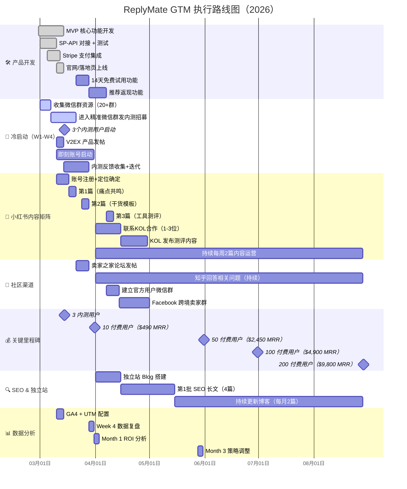

# ReplyMate GTM 时间线甘特图

## 6个月执行路线图



---

## 关键节点说明

### 必须完成（Critical Path）

```
完成MVP → 上线官网 → 微信群内测招募 → 3个内测用户
→ 产品迭代 → 转化付费 → 10个付费用户
→ 小红书内容矩阵 → KOL合作 → 50个付费用户
→ 口碑裂变 + SEO → 200个付费用户
```

### 并行执行（可同时进行）

- 微信群招募 ‖ 小红书内容运营 ‖ V2EX 发帖
- 产品迭代 ‖ 用户社群运营 ‖ SEO 博客
- KPI 监控（每周持续进行）

### 风险节点

| 节点 | 风险 | 缓解 |
|------|------|------|
| Week 2：3个内测用户 | 没人愿意内测 | 提供$0 内测 + 1对1白手套服务 |
| Month 1：10个付费用户 | 内测转付费率低 | 延长免费试用期至30天 |
| Month 3：50个付费用户 | 小红书内容没流量 | 投入$50薯条加热爆款帖子 |
