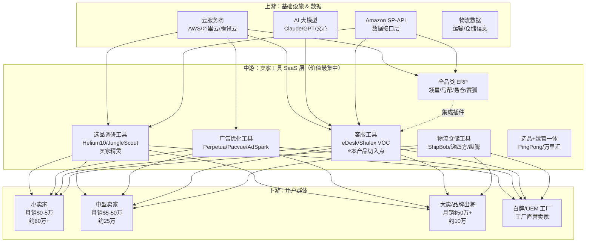

# 市场研究报告：亚马逊 AI 英文客服 SaaS
**面向中国亚马逊卖家的 AI 站内信智能回复工具**

> 调研日期：2026-02-28 | 置信度：中高（部分数据需一手验证）

---

## 执行摘要

### 关键发现

| 维度 | 结论 |
|------|------|
| 市场规模 | 中国亚马逊活跃卖家约 **95万**，目标用户约 **10-30万** 中小卖家 |
| 痛点真实性 | ★★★★★ 英文客服是中国卖家的高频、真实痛点 |
| 竞品空白 | Helium10/JS 无此功能；eDesk 是最直接竞品，但面向欧美用户 |
| 技术风险 | ⚠️ **严重：SP-API Messaging API 不支持读取买家来信** |
| 定价合理性 | $49-99/月 区间合理，但需验证中国卖家付费转化率 |
| 综合可行性 | **可行，但需先解决 API 限制问题** |

### Top 3 机会

1. **差异化定位**：国内首个专注亚马逊英文客服 AI，中文操作界面 + 中国卖家场景优化
2. **ERP 集成分发**：通过领星/马帮/易仓等主流 ERP 进行 B2B2C 分发，解决获客难题
3. **场景扩展**：从回复工具→客服知识库→差评预警→Review 运营完整客服工作台

---

## 一、行业概览

### 1.1 中国亚马逊卖家市场规模

| 指标 | 数据 | 来源 |
|------|------|------|
| 亚马逊全球卖家总数 | ~970万（2024年底） | Marketplace Pulse |
| 中国卖家占比 | **超过 50%** | Marketplace Pulse 2024 |
| 中国活跃卖家估算 | **~95万** | 推算（全球活跃190万×50%） |
| 中国卖家平均年销售额 | $393,557 | 2024 卖家状况报告 |
| 销售额超 $100万 中国卖家 | 2023-2024 增长 **55%** | 亚马逊官方数据 |
| 销售额超 $1000万 中国卖家 | 2023-2024 增长 **60%** | 亚马逊官方数据 |
| 中国跨境电商进出口总额 | **2.63万亿元**（2024年） | 海关总署 |

**关键洞察：**
- 中国卖家数量全球第一，深圳一城卖家数量即超过纽约+布鲁克林 6 倍
- 头部卖家快速增长，但整体利润偏薄，卖家对降本增效工具需求旺盛
- 从"拼规模"转向"拼体验+品牌"是 2025 年主旋律，客服质量日益重要

### 1.2 跨境卖家工具 SaaS 市场

| 指标 | 数据 |
|------|------|
| 中国跨境电商 ERP 市场规模（2024） | **19.6 亿元**（$2.7亿） |
| 年均增长率（2020-2024） | **27.8% CAGR** |
| 预测 2028 年市场规模 | **53 亿元** |

**工具付费现状：**
- 卖家工具 SaaS 订阅已是常规运营成本，Helium10 年费 $449-999 仍有大量中国用户
- 中小卖家更敏感，倾向低月费或按用量付费模式
- 头部卖家（月销 $5万+）工具预算充足，对效率工具接受度高

---

## 二、产业链全景图

### 跨境卖家工具市场产业链



### 价值分布与利润池分析

| 层级 | 玩家类型 | 利润率 | 议价能力 |
|------|----------|--------|----------|
| 上游 | 云厂商、AI 模型 | 高 | 强（供给方） |
| 中游（ERP） | 领星、马帮等 | 中（竞争激烈） | 中 |
| 中游（垂直工具） | 客服/广告/选品工具 | **中高（差异化强）** | 中高 |
| 下游 | 卖家 | 薄（价格竞争激烈） | 弱 |

**结论：中游垂直工具是最优进入点，客服工具细分赛道尚未被主流工具占据。**

---

## 三、竞品分析

### 3.1 直接竞品对比

| 竞品 | 定位 | 定价 | 核心功能 | 中国卖家适配 |
|------|------|------|----------|-------------|
| **eDesk** | 多平台电商客服 SaaS | 从 $49/月起 | AI 辅助回复、多渠道整合 | 差（英文界面，面向欧美） |
| **Shulex VOC** | 亚马逊 AI 客服 + Review 分析 | 未公开（免费+付费） | 自动回复、FAQ 生成、Review 监控 | 较好（有中文版） |
| **Freshdesk/Zendesk** | 企业级客服平台 | $15-$150/月/座席 | 工单管理，非亚马逊专属 | 差 |
| **SellerApp** | 亚马逊运营工具 | $49-$149/月 | 选品+关键词，无专门客服模块 | 差 |
| **Helium10** | 全能亚马逊工具 | $99-$249/月 | 选品/关键词/Listing，**无客服模块** | 中（有中文版） |
| **Jungle Scout** | 产品调研工具 | $49-$129/月 | 选品调研，**无客服模块** | 差 |

### 3.2 关键竞争空白

Helium10 和 Jungle Scout **均无专属客服/站内信管理功能**，这是明确的产品空白。

eDesk 虽然做 Amazon CS，但：
1. 英文界面，不适合中国卖家
2. 没有针对中国卖家的英文回复场景优化（物流纠纷、差评沟通等）
3. 不了解中国卖家的合规痛点（安全/品控投诉回复话术）

**Shulex VOC 是最接近的直接竞品**，需重点关注其功能边界和定价策略。

---

## 四、⚠️ 关键技术风险：SP-API 限制

> **这是整个商业模式最大的技术风险，必须在产品立项前验证。**

### 问题描述

根据 Amazon SP-API 开发者文档和 GitHub 社区讨论（2024年1月确认）：

**SP-API Messaging API 的实际能力：**
- ✅ 可以：向买家发送特定类型的消息（订单确认、物流通知等）
- ❌ **不支持：读取买家发来的站内信（Buyer Messages Inbox）**
- ❌ **不支持：通过 API 回复买家来信**

### 影响评估

原产品设计："自动读取买家站内消息（SP-API Messaging API）" — **这个功能目前无法通过官方 API 实现。**

### 可能的解法

| 方案 | 可行性 | 风险 |
|------|--------|------|
| Seller Central 网页自动化（爬虫/模拟点击） | 技术可行 | 违反亚马逊服务条款，账号有封禁风险 |
| 等待/申请亚马逊官方开放 Buyer Messages API | 不确定时间 | 依赖第三方平台 |
| 与 ERP 工具合作（领星等已有此数据） | **可行** | 需要合作谈判，议价能力弱 |
| 申请 SP-API Solution Provider 资质 | 需申请 | 可获得更多 API 权限 |

**建议：在立项前，先明确通过何种技术路径读取买家消息，这是产品的生死线。**

---

## 五、用户画像与痛点

### 目标用户：中型中国亚马逊卖家

```
年销售额：$30万 - $500万（月销$2.5万-$40万）
SKU数量：20-500个
客服消息量：每日 20-200 条
团队规模：3-20人
英语能力：老板懂一些，客服员工基本不懂
```

### 核心痛点（真实性 ★★★★★）

1. **语言障碍**：中国客服回复英文耗时长，质量差，回复率不达标（亚马逊要求24h内回复）
2. **合规压力**：不知道如何正确回复投诉避免账号风险
3. **重复性高**：70%+ 的买家消息是标准问题（物流查询、退换货、使用方法）
4. **成本高**：雇佣英语流利客服月薪 ¥8000-15000，且难以招聘
5. **时区问题**：买家凌晨发消息，卖家睡觉，响应时间超标

### 付费意愿评估

| 用户类型 | 付费意愿 | 合理预算 |
|----------|----------|----------|
| 月销 $5万+ 卖家 | 高 | $99-$299/月 |
| 月销 $1-5万 卖家 | 中 | $29-$99/月 |
| 月销 $1万以下 | 低 | $9-$29/月 或 免费 |

**结论：$49/月（500条）和 $99/月（无限）定价对月销 $2万+ 的卖家是合理的，ROI 明显。**

---

## 六、定价合理性分析

### 行业对标

| 工具类型 | 典型定价 | 参考 |
|----------|----------|------|
| 全能亚马逊工具（Helium10） | $99-$249/月 | 选品+关键词 |
| 专项工具（eDesk 客服） | $49-$199/月 | 客服SaaS |
| 广告优化工具 | $49-$299/月 | 按广告支出比例 |
| 中国卖家 ERP（领星/马帮） | ¥500-3000/月 | 约$70-420/月 |

### 定价策略评估

**$49/月（500条）** — 合理
- 对应约每天 16 条消息，适合中小卖家
- 接近 eDesk 入门价，有竞争力
- 单条成本约 $0.098（含 Claude API 成本约 $0.01-0.05/条），毛利可观

**$99/月（无限）** — 合理偏高
- 需要明确"无限"的实际上限或 Fair Use Policy
- 建议考虑中间档：$79/月（2000条）

**改进建议：**
```
Free:    50条/月（体验版）
Starter: $29/月（300条）  ← 增加此档位吸引小卖家
Pro:     $59/月（1000条）
Business:$99/月（5000条）
```

---

## 七、可行性综合评估

### 评分矩阵

| 评估维度 | 权重 | 得分（1-5） | 加权分 | 备注 |
|----------|------|------------|--------|------|
| 市场规模 | 20% | 5 | 1.00 | 95万+中国活跃卖家，目标人群大 |
| 增长潜力 | 20% | 4 | 0.80 | 跨境SaaS 28% CAGR，AI渗透率上升 |
| 竞争强度 | 15% | 4 | 0.60 | 中国卖家专属客服工具基本空白 |
| 进入门槛 | 15% | 2 | 0.30 | SP-API 限制是重大技术障碍 |
| 变现能力 | 15% | 4 | 0.60 | SaaS 订阅，毛利率高（60%+） |
| 执行难度 | 10% | 3 | 0.30 | 技术不复杂，获客是核心挑战 |
| 风险程度 | 5% | 2 | 0.10 | API 政策风险，亚马逊竞争风险 |

**综合得分：3.70 / 5.00**（满足可行性门槛 ≥ 3.0，值得推进）

### 可行性结论

**值得做，但有条件：**

✅ **支持做的理由：**
- 痛点真实、高频，中国卖家英文客服是刚需
- 竞品空白明显，Helium10/JS 没有这个功能
- SaaS 模式毛利高，MRR 可预期
- 目标 $5K MRR = 约 100 付费用户（$49档），可行

⚠️ **必须先解决的问题：**
1. **技术路径**：如何合法读取买家消息（SP-API 官方路径不通，需找替代方案）
2. **获客渠道**：中国卖家在哪里（跨境电商社群、ERP 合作、AMZ123等媒体）
3. **合规风险**：如用网页自动化，需评估账号安全风险对用户的影响

---

## 八、赚钱机会分析

### 机会 1：独立 AI 客服 SaaS（主线）⭐⭐⭐⭐

**定位**：专为中国亚马逊卖家打造的 AI 英文站内信回复工具

**执行路径：**
1. 解决 API 问题（优先申请 SP-API Solution Provider 资质）
2. MVP：Chrome 插件 + Claude API，在 Seller Central 页面内嵌 AI 回复按钮
3. 冷启动：跨境电商微信群 + 知乎/AMZ123 免费试用活动
4. 增长：入驻领星、马帮等 ERP 插件市场

**6个月 $5K MRR 路径：**
- 月1-2：Beta 测试，50 免费用户收集反馈
- 月3-4：付费转化，目标 30 付费用户（avg $50）= $1.5K MRR
- 月5-6：增长加速，目标 100 付费用户 = $5K MRR
- 关键转化率假设：免费→付费 15-20%（需验证）

**综合评分：3.7 / 5.0 | 优先级：高**

---

### 机会 2：ERP 内嵌客服插件（B2B 分发）⭐⭐⭐⭐

**定位**：与领星 ERP / 马帮 ERP 合作，作为客服模块嵌入

**优势：**
- 直接获取已验证的付费用户
- 无需解决 API 问题（ERP 已有数据）
- 快速规模化

**劣势：**
- 需要谈判，早期议价能力弱
- 收益分成（预计 ERP 抽 30-50%）

**综合评分：3.5 / 5.0 | 优先级：中（配合主线）**

---

### 机会 3：AI 客服模板知识库（低成本副线）⭐⭐⭐

**定位**：出售亚马逊英文客服模板包（退款/差评/FBA问题等场景），配合 AI 生成工具

**模式**：一次性购买 $29-99 模板包 或 订阅 $9/月

**优势**：无技术门槛，快速验证市场

**综合评分：3.0 / 5.0 | 优先级：低（验证用）**

---

## 九、风险与挑战

| 风险 | 概率 | 影响 | 应对 |
|------|------|------|------|
| SP-API 不支持读取买家消息 | **已确认** | 高 | 申请 Solution Provider 或走 Chrome 插件路线 |
| 亚马逊封禁自动化工具 | 中 | 极高 | 确保"辅助人工"模式，不全自动发送 |
| 竞品（Shulex等）快速跟进 | 中 | 中 | 深耕中国卖家场景，做更垂直 |
| 中国卖家付费转化率低 | 中高 | 中 | 验证期给足免费额度，降低决策门槛 |
| Claude API 成本超预期 | 低 | 中 | 做好用量控制，设置请求上限 |
| 亚马逊推出官方 AI 客服 | 低（短期） | 极高 | 关注 Project Amelia 动态 |

---

## 十、行动建议

### 30天验证计划

```
Week 1: 技术验证
  - 申请亚马逊 SP-API Solution Provider 资质
  - 确认是否有合法 API 读取买家消息
  - 备选：评估 Chrome 插件可行性和合规风险

Week 2: 用户验证
  - 加入 10 个跨境电商微信群/Discord
  - 访谈 20 个中型卖家，确认付费意愿
  - 投票：$49/月 vs $29/月 vs 按条收费

Week 3-4: MVP 开发
  - Chrome 插件：在 Seller Central 邮件页面嵌入 AI 回复按钮
  - 接入 Claude API（claude-sonnet-4-6）
  - 支持 10 种常见消息类型（退款/物流/差评等）

Month 2: 冷启动
  - AMZ123 / 知乎 / 跨境电商圈 发免费试用帖
  - 目标：50 个 Beta 用户
  - 收集：哪种消息场景最常用、AI 回复质量如何
```

### 关键指标（$5K MRR 目标）

| 指标 | 目标值 |
|------|--------|
| 注册用户 | 500+ |
| 免费→付费转化 | 15-20% |
| 付费用户 | 100 |
| 平均 ARPU | $50 |
| 月流失率 | <5% |
| LTV/CAC | >3x |

---

## 数据来源

- [Marketplace Pulse - 中国卖家占比超50%](https://www.sypost.com/news/3/960)
- [亚马逊《2024中国出口跨境电商白皮书》](https://gs.amazon.cn/news/news-brand-240816)
- [2024年底亚马逊卖家总数将超970万](https://www.amz123.com/t/MscIbvsS)
- [跨境电商ERP市场研究报告 2024](https://img.frostchina.com/attachment/17623584/oKvxHKZBRnAkQHFY88vhGd.pdf)
- [eDesk Pricing 2025 - G2](https://www.g2.com/products/edesk/pricing)
- [Amazon SP-API Messaging API 限制讨论](https://github.com/amzn/selling-partner-api-models/discussions/3487)
- [Shulex AI 客服 - 新浪财经](https://finance.sina.com.cn/roll/2024-07-25/doc-incfhxxp8809854.shtml)
- [Helium10 中国定价](https://www.zhihu.com/question/505487843)
